# Documento de Diseño de Software: Plataforma de Medición de Métricas DORA

**Versión:** 12.3 (Sincronización con Implementación del MVP)
**Autor:** Edson Abraham Chavez Montaño
**Fecha:** 7 de Setiembre de 2025 (Actualizado)

---

## 1. Introducción

### 1.1. Propósito
El presente documento describe la arquitectura, los componentes y el diseño general de la solución de software propuesta en la tesis "Implementación de una solución para la medición de métricas DORA de entrega de software para equipos de desarrollo". Este documento servirá como guía técnica para la implementación del proyecto.

### 1.2. Resumen del Proyecto
El proyecto consiste en el desarrollo de una plataforma para la medición continua y automatizada del rendimiento de entrega de software, centrándose en las cuatro métricas clave de DORA (Frecuencia de Despliegue, Tiempo de Espera para Cambios, Tasa de Fallo de Cambio y Tiempo Medio de Recuperación). La solución extraerá datos de herramientas existentes en el ciclo de vida de desarrollo, los procesará y calculará las métricas y los presentará en dashboards visuales para facilitar la toma de decisiones basada en datos.

---

## 2. Objetivos y Resultados Esperados

### 2.1. Objetivo General
Implementar una solución para la medición continua del rendimiento de entrega de software en equipos de desarrollo, automatizando la recolección de datos de herramientas existentes, con el fin de proporcionar una base para la mejora continua y la predicción de resultados organizacionales.

### 2.2. Objetivos Específicos y Resultados Esperados

* **O1: Automatizar la recolección y consolidación de datos del ciclo de vida.**
    * **Resultado Esperado 1.1:** Un Módulo de Integración de Datos (`module-collector`) capaz de extraer y consolidar automáticamente los eventos clave del ciclo de vida del software desde las APIs de GitHub, Jira y DataDog.
    * **Resultado Esperado 1.2:** Una base de datos centralizada y estructurada que almacena de forma persistente tanto los datos crudos recolectados (`Raw_Events`) como las entidades de dominio procesadas (ej. `Commits`, `Deployments`).

* **O2: Calcular de manera continua métricas de desempeño de entrega.**
    * **Resultado Esperado 2.1:** Un Módulo de Procesamiento (`module-processor`) que calcula de forma continua y idempotente las cuatro métricas DORA a partir de las entidades de dominio estructuradas.
    * **Resultado Esperado 2.2:** La capacidad del sistema para agregar y almacenar las métricas calculadas (`Calculated_Metrics`) a nivel de repositorio individual y por equipo, permitiendo un análisis detallado del rendimiento.

* **O3: Implementar medios de visualización y reporte de métricas como apoyo a la toma de decisiones.**
    * **Resultado Esperado 3.1:** Un dashboard interactivo (utilizando Grafana embebido) que visualice las métricas DORA y sus tendencias a lo largo del tiempo, con vistas adaptadas a cada rol de usuario.
    * **Resultado Esperado 3.2:** Un Módulo de Notificaciones (`module-notifications`) capaz de enviar alertas por correo electrónico cuando se detecten desviaciones significativas en el rendimiento.

---

## 3. Alcance y Limitaciones

### 3.1. Dentro del Alcance (Visión Completa del Sistema)
- Desarrollo de un **Módulo de Integración** para la recolección de datos de GitHub, Jira y DataDog.
- Desarrollo de un **Módulo de Procesamiento** para el cálculo continuo de las 4 métricas DORA.
- Implementación de una **interfaz web** con un **Módulo de Visualización**.
- Implementación de un sistema de **alertas por correo electrónico**.
- Desarrollo de un **Módulo de Gestión de Roles**.
- Desarrollo de un **Módulo de Configuración del Sistema**.

### 3.2. Fuera del Alcance General
- El desarrollo de una aplicación móvil.
- La integración con herramientas distintas a las mencionadas en el alcance.

### 3.3. Alcance de la Implementación (MVP para la Tesis)
Para asegurar la entrega de un producto funcional en el tiempo estipulado, la implementación se centrará en un Producto Mínimo Viable (MVP) con el siguiente alcance:

* **Funcionalidades Incluidas en el MVP:**
    * **Integraciones:** Se implementará la integración completa con las 3 fuentes de datos: **GitHub, Jira y DataDog**.
    * **Cálculo de Métricas:** Se implementará el cálculo de las **4 métricas DORA**.
    * **Seguridad y Roles:** Se implementará el flujo de login completo con **GitHub**, la restricción por organización y la **gestión de roles** en la interfaz de usuario.
    * **Visualización:** Se implementará el dashboard con **vistas adaptativas** según el rol del usuario.
    * **Alertas:** Se implementará el sistema de **alertas por correo electrónico**.

* **Funcionalidades Simplificadas o Excluidas del MVP (Trabajo Futuro):**
    * **Gestión de Conexiones en la UI:** La configuración de las conexiones (claves de API, nombre de la organización) se manejará **exclusivamente a través de variables de entorno** en el despliegue. Se pospone la creación de la interfaz de usuario para esta gestión.
    * **Sincronización Manual en la UI:** El caso de uso para disparar una sincronización manual desde la interfaz de usuario se pospondrá. La sincronización operará únicamente de forma automática y periódica.
    * **Módulo de Observabilidad:** Una futura versión podría incluir un módulo dedicado a monitorear la salud del propio sistema de métricas (ej. estado de los jobs, latencia de la API, etc.).
    * **Módulo de Gobernanza de Datos:** Para gestionar el ciclo de vida de los datos, incluyendo políticas de retención y anonimización para cumplir con normativas de privacidad.

---

## 4. Personas y Roles de Usuario (RBAC)
El sistema implementará un Control de Acceso Basado en Roles (RBAC) estricto con una clara separación de responsabilidades.

- **Administrador:**
    - **Acceso:** Total a las funcionalidades de **configuración del sistema** (gestión de roles, conexiones, etc.).
    - **Visibilidad de Datos:** Acceso de lectura a todos los dashboards y métricas.
    - **Función (Técnica):** Su propósito principal es **configurar, mantener y depurar la plataforma**. La visualización de datos le sirve para verificar que el sistema funciona correctamente y para investigar posibles problemas en la recolección o procesamiento.
- **Engineering Manager:**
    - **Acceso:** Acceso de solo lectura a los dashboards. No tiene acceso a las pantallas de configuración del sistema.
    - **Visibilidad de Datos:** Tiene una visión global de todas las métricas, de todos los equipos y todos los repositorios.
    - **Función (Estratégica):** Su propósito es **analizar el rendimiento de la organización**, comparar equipos e identificar tendencias para la toma de decisiones estratégicas.
- **Tech Lead:**
    - **Acceso:** Acceso de solo lectura a los dashboards de su equipo.
    - **Visibilidad de Datos:** Tiene acceso únicamente a las métricas de los repositorios y desarrolladores que pertenecen a su equipo.
    - **Función (Táctica):** Monitorear la salud y el rendimiento de su equipo para guiar mejoras a corto y mediano plazo.
- **Desarrollador:**
    - **Acceso:** Acceso de solo lectura a los dashboards de los repositorios en los que participa.
    - **Visibilidad de Datos:** Visualiza las métricas relacionadas con su trabajo directo. Rol por defecto.
    - **Función (Operativa):** Obtener feedback rápido sobre el impacto de su trabajo en el ciclo de entrega.

---

## 5. Arquitectura de Alto Nivel
La solución seguirá una arquitectura modular, con un claro desacoplamiento entre la recolección de datos, el procesamiento y la presentación. La comunicación entre el frontend y el backend se realizará exclusivamente a través de una API REST segura.

### 5.1. Estilo Arquitectónico del Backend
Para el backend, se ha elegido un enfoque de **Monolito Modular**. Esta decisión equilibra la simplicidad de desarrollo y despliegue de una aplicación monolítica con la disciplina de separación de dominios y bajo acoplamiento de una arquitectura de microservicios. Para implementar y verificar esta arquitectura, se utilizará el proyecto **Spring Modulith**.

- **Ventajas para este proyecto:**
    - **Un único repositorio y pipeline de CI/CD:** Reduce la complejidad operativa.
    - **Comunicación directa y performante entre módulos:** Evita la latencia de red y la complejidad de la comunicación entre servicios.
    - **Mantenimiento de la separación de dominios:** El código se organiza en módulos lógicos que evitan el acoplamiento indebido.
    - **Verificación Arquitectónica:** Spring Modulith permitirá crear pruebas que verifiquen automáticamente que las dependencias entre módulos son correctas, previniendo el deterioro arquitectónico.
    - **Preparado para el futuro:** Facilita la extracción de un módulo a un microservicio si fuera necesario en el futuro.

La comunicación entre los procesos de recolección y procesamiento de datos será **asíncrona y mediada por la base de datos**.
***Nota de Diseño (Comunicación Asíncrona):*** *Este enfoque es una simplificación pragmatica para el alcance de este proyecto. Una evolución natural para un sistema a mayor escala sería incorporar un message broker dedicado (como RabbitMQ o Kafka) para un desacoplamiento aún más robusto.*

***Nota de Diseño (API REST vs. GraphQL):*** *Para la comunicación entre el frontend y el backend, se ha elegido una API REST por su simplicidad de implementación y su robusto ecosistema en Spring Boot. Si bien GraphQL podría ofrecer una mayor eficiencia en la obtención de datos para dashboards complejos, la combinación de una API REST bien diseñada con TanStack Query en el frontend mitiga los problemas de "over-fetching" y "under-fetching" de manera efectiva para el alcance de este proyecto. GraphQL se considera una posible evolución futura si los requisitos de consulta de datos se vuelven significativamente más complejos.*

### Diagrama de Flujo de Componentes
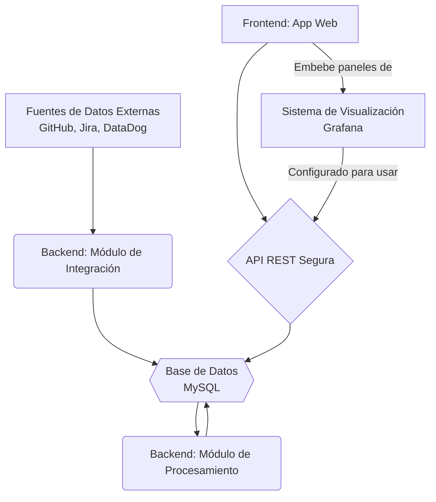
```mermaid
graph TD;
    A[Fuentes de Datos Externas <br> GitHub, Jira, DataDog] --> B(Backend: Módulo de Integración);
    B --> C{{Base de Datos <br> MySQL}};
    C --> D(Backend: Módulo de Procesamiento);
    D --> C;
    E{API REST Segura} --> C;
    F[Frontend: App Web] --> E;
    G[Sistema de Visualización <br> Grafana] -- Configurado para usar --> E;
    F -- Embebe paneles de --> G;
```

---

## 6. Detalle de Componentes del Backend

### 6.1. Vista General de Módulos
El backend se estructurará como un **Monolito Modular** utilizando **Spring Modulith**. El proyecto se organizará en los siguientes módulos lógicos (paquetes de Java), cada uno con responsabilidades bien definidas.

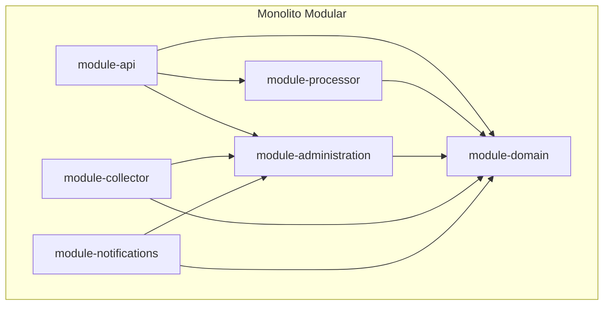
```mermaid
graph TD;
    subgraph Monolito Modular
        M_DOMAIN[module-domain]

        M_API[module-api] --> M_DOMAIN;
        M_PROCESSOR[module-processor] --> M_DOMAIN;
        M_ADMIN[module-administration] --> M_DOMAIN;
        M_COLLECTOR[module-collector] --> M_DOMAIN;
        M_NOTIFICATIONS[module-notifications] --> M_DOMAIN;

        M_API --> M_PROCESSOR;
        M_API --> M_ADMIN;
        M_COLLECTOR --> M_ADMIN;
        M_NOTIFICATIONS --> M_ADMIN;
    end
```
***Nota de Diseño:*** *Las dependencias entre módulos serán verificadas a través de pruebas de Spring Modulith. La comunicación entre `module-processor` y `module-notifications` se realiza de forma desacoplada a través de eventos de dominio, eliminando una dependencia de compilación directa. Las dependencias restantes son intencionales para permitir la orquestación y el acceso a la configuración.*

### 6.2. Detalle por Módulo

* **6.2.1. `module-domain`**
    * **Responsabilidad:** Actúa como el núcleo de la aplicación. Define la **Única Fuente de Verdad** para el modelo de datos.
    * **Componentes:** Clases de Entidad JPA (`@Entity`) e interfaces de Repositorio de Spring Data JPA (`JpaRepository`). **No contiene DTOs.**

* **6.2.2. `module-collector`**
    * **Responsabilidad:** Conectarse a las APIs externas para recolectar eventos de forma **idempotente**. Su función es guardar cada evento externo una única vez en la tabla `Raw_Events`. Utiliza DTOs específicos para cada fuente externa, implementando el patrón **Anticorruption Layer (ACL)**.
    * **Componentes:** Clases de servicio para cada integration, DTOs específicos para las APIs externas, lógica de scheduling con manejo de errores de duplicados.
    * ***Nota de Diseño (Estrategia de API Externa):*** *La elección de la API (REST vs. GraphQL) para la recolección de datos dependerá de la herramienta externa. Para **GitHub**, se priorizará el uso de su **API GraphQL (v4)** debido a su alta eficiencia, ya que permite obtener datos complejos y anidados (como PRs con sus commits y despliegues asociados) en una sola petición, minimizando el número de llamadas y el riesgo de alcanzar los límites de tasa. Para **Jira y DataDog**, se utilizarán sus **APIs REST** estándar, ya que son la principal interfaz que ofrecen.*

* **6.2.3. `module-processor`**
    * **Responsabilidad:** Orquestar el pipeline de datos interno de forma resiliente.
        1.  Lee un lote de `Raw_Events` en estado `PENDING`.
        2.  Parsea los payloads y los transforma en entidades de dominio estructuradas.
        3.  Si el procesamiento de un evento falla, lo marca como `FAILED`, registra el error, y continúa con el siguiente.
        4.  Si es exitoso, calcula las métricas DORA y guarda los resultados.
        5.  Marca los `Raw_Events` exitosos como `COMPLETED`.
        6.  **Publica un evento de dominio** (ej. `MetricThresholdExceededEvent`) si se detectan cambios significativos en las métricas.
    * **Componentes:** Calculadoras de métricas, lógica de agregación, lógica de scheduling transaccional, manejo de errores.

    * **6.2.3.1. Lógica de Cálculo de Métricas**
        - **Métricas de Velocidad (Velocity)**
            - **A. Frecuencia de Despliegue (Deployment Frequency)**
                - **Definición:** Mide la frecuencia con la que el software se despliega exitosamente en producción. Indica la capacidad de entrega del equipo.
                - **Eventos a Extraer:** Despliegues exitosos al entorno de producción.
                - **Fórmula:** `Frecuencia de Despliegue = NÚMERO_TOTAL_DE_DESPLIEGUES_EXITOSOS / PERÍODO_DE_TIEMPO_EN_DÍAS`
                - **Agregación:** Se calcula como una cuenta de eventos durante un período (ej. despliegues por semana).
                - **Datos Necesarios:** `deployment_id`, `timestamp_deployment`, `status ('success')`, `environment ('production')`.
                - ***Nota de Diseño (Fuente de Verdad del Despliegue):*** *Un despliegue se define como un evento explícito proveniente del sistema de CI/CD (ej. un workflow de GitHub Actions que termina de forma exitosa). **No se debe inferir un despliegue a partir de un merge commit a la rama principal.** El `module-collector` debe buscar eventos específicos como los generados por la API de Deployments de GitHub, que indican un despliegue real a un entorno específico.*

            - **B. Tiempo de Espera para Cambios (Lead Time for Changes)**
                - **Definición:** Mide el tiempo que transcurre desde que se inicia el trabajo en un cambio (commit) o en una feature (Pull Request) hasta que ese cambio o feature es desplegado exitosamente en producción. Es una medida clave de la eficiencia del proceso de entrega. La métrica final se agrega preferiblemente usando la **mediana** para reducir el impacto de valores atípicos.

                - **Eventos a Extraer:**
                    1.  **De los Despliegues:** `deployment_id`, `deployment_time` (timestamp del despliegue), `head_sha` (el SHA del commit desplegado).
                    2.  **De los Commits:** `sha`, `timestamp` (timestamp del commit), `parent_shas` (lista de SHAs de los commits padres, crucial para reconstruir el historial).
                    3.  **De los Pull Requests:** `id`, `merge_commit_sha` (el SHA del commit de fusión), `first_commit_sha` (el SHA del primer commit del PR, que debe ser recolectado durante la sincronización).

                - **Fórmulas:**
                    - **Por commit individual:** `Lead Time (commit) = TIMESTAMP_DESPLIEGUE - TIMESTAMP_COMMIT`
                    - **Por Pull Request:** `Lead Time (PR) = TIMESTAMP_DESPLIEGUE - TIMESTAMP_PRIMER_COMMIT_DEL_PR`

                - **Implementación Detallada del Cálculo (Proceso por Lotes):**
                  El cálculo no se dispara con cada despliegue, sino que se ejecuta como un proceso por lotes (`batch job`) que opera exclusivamente sobre los datos ya sincronizados en la base de datos local, sin llamadas a APIs externas.
                    1.  **Paso 1: Obtener Despliegues Ordenados.** El job consulta todos los `Deployment` de la base de datos, ordenados cronológicamente por `deployment_time`.
                    2.  **Paso 2: Procesar Despliegues por Pares.** Se itera sobre los despliegues. Para cada despliegue `D_n`, se identifica su despliegue exitoso anterior, `D_n-1`. El rango de análisis queda definido por el `previous_head_sha` (de `D_n-1`) y el `current_head_sha` (de `D_n`).
                    3.  **Paso 3: Reconstruir el "Lote" de Commits.** Se realiza una "caminata" hacia atrás en la tabla `Commit` local, comenzando desde `current_head_sha` y siguiendo los `parent_shas` de cada commit. Se recolectan todos los commits visitados hasta encontrar el `previous_head_sha`. La lista de commits recolectados constituye el "lote" de cambios que se introdujeron en el despliegue `D_n`.
                    4.  **Paso 4: Calcular y Almacenar Lead Time por Commit.** Para cada `commit` en el "lote", se calcula su `Lead Time` y se almacena en una tabla (ej. `ChangeLeadTime`) junto con el `commit_sha` y el `deployment_id`.
                    5.  **Paso 5: Identificar Pull Requests en el Lote.** Se toma la lista de SHAs del "lote" de commits. Se consulta la tabla `PullRequest` para encontrar todos los PRs cuyo `merge_commit_sha` esté en esa lista.
                    6.  **Paso 6: Calcular y Almacenar Lead Time por Pull Request.** Para cada `PullRequest` identificado:
                        - Se obtiene su `first_commit_sha`.
                        - Se busca el `timestamp` de ese commit en la tabla `Commit`.
                        - Se calcula el `Lead Time` usando la fórmula para PR.
                        - El resultado se almacena en una tabla (ej. `PullRequestLeadTime`) junto con el `pull_request_id` y el `deployment_id`.
                    7.  **Paso 7: Agregación para la Métrica Final.** Cuando un usuario consulta el dashboard, el sistema lee las tablas `ChangeLeadTime` y/o `PullRequestLeadTime`, filtra por el período solicitado y calcula la **mediana** de los `lead_time` para presentar la métrica DORA final.
        - **Métricas de Estabilidad (Stability)**
            - **C. Tasa de Fallo de Cambio (Change Fail Rate)**
                - **Definición:** Mide el porcentaje de despliegues a producción que resultan en una degradación del servicio y requieren una acción para ser remediados (ej. un hotfix, un rollback, un parche).
                - **Eventos a Extraer:**
                    1.  **Número Total de Despliegues:** La cuenta de todos los despliegues a producción en un período.
                    2.  **Número de Fallos:** La cuenta de incidentes (de DataDog) que están directamente correlacionados con un despliegue. Esta correlación se puede establecer si un incidente se crea poco después de un despliegue en el mismo servicio.
                - **Fórmula:** `Tasa de Fallo de Cambio = (NÚMERO_DE_FALLOS / NÚMERO_TOTAL_DE_DESPLIEGUES) * 100`
                - **Agregación:** Un porcentaje calculado sobre un período de tiempo (ej. la tasa de fallo del último mes).
                - **Datos Necesarios:** `deployment_id`, `deployment_timestamp`, `incident_id`, `incident_creation_timestamp`. Se necesita una lógica para vincular un `incident_id` a un `deployment_id`.

            - **D. Tiempo de Restauración del Servicio (Time to Restore Service)**
                - **Definición:** Mide el tiempo que toma recuperarse de un fallo en producción. Indica la capacidad de resiliencia del sistema y del equipo.
                - **Eventos a Extraer:**
                    1.  **Timestamp de Creación del Incidente:** La fecha y hora en que se detecta y registra un incidente en DataDog.
                    2.  **Timestamp de Resolución del Incidente:** La fecha y hora en que el incidente es marcado como resuelto en DataDog.
                - **Fórmula:** Para cada incidente: `Tiempo de Restauración (incidente) = TIMESTAMP_RESOLUCIÓN_INCIDENTE - TIMESTAMP_CREACIÓN_INCIDENTE`
                - **Agregación:** La métrica final es el **promedio** o la **mediana** del `Tiempo de Restauración` de todos los incidentes ocurridos en un período de tiempo.
                - **Datos Necesarios:** `incident_id`, `incident_creation_timestamp`, `incident_resolution_timestamp`.

* **6.2.4. `module-notifications`**
    * **Responsabilidad:** **Escuchar eventos de dominio** y gestionar el envío de notificaciones salientes en respuesta a ellos.
    * **Componentes:** Oyentes de eventos (`@EventListener`), Servicio de Email, plantillas de correo.

* **6.2.5. `module-administration`**
    * **Responsabilidad:** Gestionar la configuración del sistema (incluyendo el cifrado de secretos) y los roles de usuario.
    * **Componentes:** Lógica de negocio para la gestión de roles y configuración, servicio de criptografía.

* **6.2.6. `module-api`**
    * **Responsabilidad:** Exponer los datos y la funcionalidad a través de una API REST pública y segura. Actúa como la **fachada y orquestador** para todas las peticiones externas.
    * **Componentes:** Controladores REST que delegan la lógica a los servicios de los módulos `-processor` y `-administration`. DTOs que definen el contrato de la API. Configuración de Spring Security para OAuth y RBAC.

### 6.3. Base de Datos (MySQL)
El modelo de datos detallado, incluyendo las entidades, sus relaciones y la estrategia de indexación, se encuentra en el **Apéndice A**.

---

## 7. Estrategia de Agregación y Visualización de Datos
El valor real de las métricas se obtiene al poder analizarlas desde diferentes perspectivas. Esta sección define cómo se agregarán y desagregarán los datos para servir a los distintos roles de usuario.

### 7.1. Niveles de Agregación
La plataforma soportará una jerarquía de agregación de datos para proporcionar vistas desde lo más general a lo más específico.

- **Nivel 1: Organzación:** La vista de más alto nivel. Todas las métricas de todos los equipos y repositorios se agregan para mostrar el rendimiento global de la ingeniería.
- **Nivel 2: Equipo:** Las métricas de todos los repositorios que pertenecen a un equipo específico se agregan para mostrar el rendimiento de dicho equipo.
- **Nivel 3: Repositorio:** Es el nivel más granular donde se calculan las métricas. Muestra el rendimiento de un componente o servicio individual.

### 7.2. Ejes de Desagregación (Filtrado)
Los usuarios podrán filtrar y segmentar los datos en los dashboards a través de varios ejes para un análisis más profundo.

- **Por Período de Tiempo:** El eje principal para el análisis de tendencias. Los usuarios podrán seleccionar rangos predefinidos (ej. últimos 7 días, último mes, último trimestre) o un rango de fechas personalizado.
- **Por Equipo:** Permitirá comparar el rendimiento entre diferentes equipos.
- **Por Repositorio:** Permitirá analizar en detalle el rendimiento de un proyecto o servicio específico.

### 7.3. Mapeo a Roles y Permisos
La capacidad de ver ciertos niveles de agregación y aplicar filtros estará directamente controlada por el rol del usuario, en línea con el modelo RBAC.

- **Administrador:**
    - **Vista por defecto:** Métricas agregadas a nivel de **Organización**.
    - **Filtros:** Acceso completo a todos los filtros (tiempo, equipo, repositorio) para facilitar la depuración y verificación del sistema.
- **Engineering Manager:**
    - **Vista por defecto:** Métricas agregadas a nivel de **Organización**.
    - **Filtros:** Acceso completo a todos los filtros (tiempo, equipo, repositorio) para permitir un análisis estratégico exhaustivo.
- **Tech Lead:**
    - **Vista por defecto:** Métricas agregadas a nivel de **Equipo**.
    - **Filtros:** Puede filtrar por período de tiempo y desagregar los datos para ver las métricas de cada **Repositorio** individual dentro de su equipo.
- **Desarrollador:**
    - **Vista por defecto:** Métricas a nivel de **Repositorio** para los proyectos en los que contribuye.
    - **Filtros:** Puede filtrar por período de tiempo. No puede ver datos de otros equipos o repositorios a los que no tiene acceso.

---

## 8. Modelo de Seguridad
- **Autenticación y Gestión de Sesión:** Se utilizará el protocolo **OAuth 2.0 con GitHub**. La sesión del usuario se gestionará a través de una **cookie segura (`HttpOnly`, `Secure`)** establecida por el backend. Esto mitiga el riesgo de robo de tokens por ataques XSS, ya que el token de sesión no es accesible desde el JavaScript del navegador.
- **Restricción de Acceso:** El acceso a la aplicación estará restringido únicamente a los miembros de una organización de GitHub específica, configurada en el sistema.
  ***Nota de Diseño (Seguridad vs. Disponibilidad):*** *Para el MVP, la verificación de pertenencia a la organización se realizará en tiempo real contra la API de GitHub en cada inicio de sesión. Este enfoque prioriza la seguridad, garantizando que el acceso sea siempre preciso. Sin embargo, crea una dependencia directa con la API de GitHub. Una evolución futura para mejorar la disponibilidad y el rendimiento sería implementar un sistema de caché que sincronice la lista de miembros periódicamente y verifique contra esa copia local.*
- **Proceso de Arranque (Bootstrap) del Primer Administrador:** Para evitar una vulnerabilidad en el primer inicio de sesión, el proceso será más robusto.
    - Se requerirá una variable de entorno en el momento del despliegue (ej. `INITIAL_ADMIN_GITHUB_USERNAME=nombre-de-usuario`).
    - En el primer arranque, si la base de datos no contiene administradores, el sistema buscará esta variable. Solo el usuario de GitHub especificado en ella podrá convertirse en el primer administrador al iniciar sesión.
- **Autorización (RBAC):** Una vez que un usuario autorizado ha iniciado sesión, el sistema aplicará el control de acceso basado en roles para determinar qué datos y funcionalidades puede ver.
- **Protección contra CSRF:** Dado que se usan cookies de sesión, el backend implementará protección contra Cross-Site Request Forgery.
  ***Nota de Implementación (MVP):*** *Para simplificar el desarrollo inicial de la SPA, se ha adoptado una estrategia donde el backend deshabilita la protección CSRF para los endpoints específicos que la necesitan (`/logout`, `/oauth2/**`), en lugar de implementar un sistema de intercambio de tokens anti-CSRF con el frontend. La seguridad se mantiene a través de la política de CORS estricta y la naturaleza de las peticiones (ej. el logout requiere un `POST`). Una evolución futura podría implementar un sistema de tokens CSRF completo si los requisitos de seguridad se vuelven más estrictos.*
- **Gestión de Secretos (Secrets Management):**
    - Los valores sensibles (claves de API, tokens) almacenados en la tabla `System_Configurations` serán **cifrados en reposo** (encryption at rest). La implementación se realizará utilizando la librería **Jasypt (Java Simplified Encryption)**.
    - La clave de cifrado maestra se proporcionará a la aplicación a través de una **variable de entorno** (ej. `JASYPT_ENCRYPTOR_PASSWORD`).
- **Estrategia de Configuración:** Se utilizarán dos mecanismos distintos para la configuración:
    - **Variables de Entorno:** Se usarán para configuraciones de arranque e infraestructura que la aplicación necesita para iniciarse. Son estáticas y no se modifican en tiempo de ejecución. Ejemplos: `DATABASE_URL`, `JASYPT_ENCRYPTOR_PASSWORD`, `INITIAL_ADMIN_GITHUB_USERNAME`.
    - **Tabla `System_Configurations`:** Se usará para configuraciones de negocio y de la aplicación que pueden ser modificadas por un Administrador a través de la UI sin necesidad de reiniciar el sistema. Ejemplos: `GITHUB_ORGANIZATION_NAME`, `JIRA_PROJECT_KEY`, umbrales para alertas de métricas.
- **Seguridad de la API para Grafana:** El token de sesión del usuario (en la cookie) será reenviado automáticamente por el navegador en las peticiones que Grafana haga a la API, asegurando que las consultas de datos respeten los permisos del usuario.

---

## 9. Stack Tecnológico

| Componente | Herramienta/Tecnología | Justificación |
| :--- | :--- | :--- |
| **Backend** | Java 21, Spring Boot 3.5.4 | Ecosistema robusto, maduro y de alto rendimiento. Aprovecha características modernas como Hilos Virtuales. |
| **Backend (Modularidad)** | **Spring Modulith** | Para verificar y documentar la arquitectura modular, previniendo el deterioro arquitectónico. |
| **Base de Datos** | MySQL 8+ | Sistema de BD relacional de código abierto, confiable y ampliamente utilizado. |
| **Visualización** | Grafana | Estándar de la industria para dashboards de monitoreo y métricas. |
| **Frontend** | React (con Vite) | Framework moderno, declarativo y basado en componentes, ideal para SPAs complexas. Vite ofrece una experiencia de desarrollo ultrarrápida. |
| **Frontend (Estado del Servidor)** | **TanStack Query** | Estándar de facto para gestionar la comunicación con APIs, el cacheo de datos y los estados de carga/error, simplificando el código y mejorando la experiencia de usuario. |
| **Frontend (Componentes)** | **Shadcn/UI** | Librería de componentes accesibles y componibles que se integra perfectamente con Tailwind CSS, acelerando el desarrollo de la UI. |
| **Contenerización** | Docker | Para empaquetar la aplicación y sus dependencias, garantizando consistencia. |
| **CI/CD** | GitHub Actions | Para automatizar la integración, pruebas y despliegue continuo. |
| **IaC** | Terraform | Para definir y provisionar la infraestructura de nube de forma declarativa. |

---

## 10. Casos de Uso Principales
A continuación se describen los casos de uso de alto nivel, agrupados por el actor principal que los inicia.

### 10.1. Casos de Uso Generales (Cualquier Usuario Autenticado)

| Caso de Uso | Actor Principal | Resumen |
| :--- | :--- | :--- |
| **Iniciar Sesión** | Usuario (No autenticado) | El usuario inicia el flujo de autenticación a través de GitHub para acceder a la aplicación. El acceso solo se concede si pertenece a la organización configurada. |
| **Cerrar Sesión** | Usuario (Autenticado) | El usuario finaliza su sesión activa en la aplicación. |

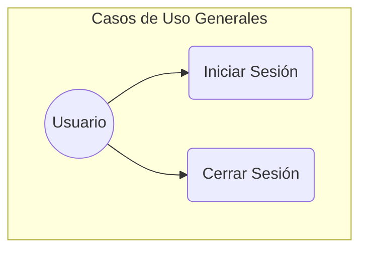
```mermaid
graph
    subgraph "Casos de Uso Generales"
        Usuario(("Usuario"))
        Usuario --> CU1(Iniciar Sesión)
        Usuario --> CU2(Cerrar Sesión)
    end
```

### 10.2. Casos de Uso de Administración (Rol: Administrador)

| Caso de Uso | Actor Principal | Resumen |
| :--- | :--- | :--- |
| **Configuración Inicial** | Primer Usuario | El primer usuario que inicia sesión en un sistema no configurado se convierte en Administrador y es guiado para realizar la configuración inicial. |
| **Gestionar Conexiones** | Administrador | El administrador puede añadir, editar o eliminar las configuraciones de conexión a las APIs externas (GitHub, Jira, DataDog). |
| **Gestionar Roles** | Administrador | El administrador puede asignar, ver y revocar los roles de los usuarios de la aplicación. |

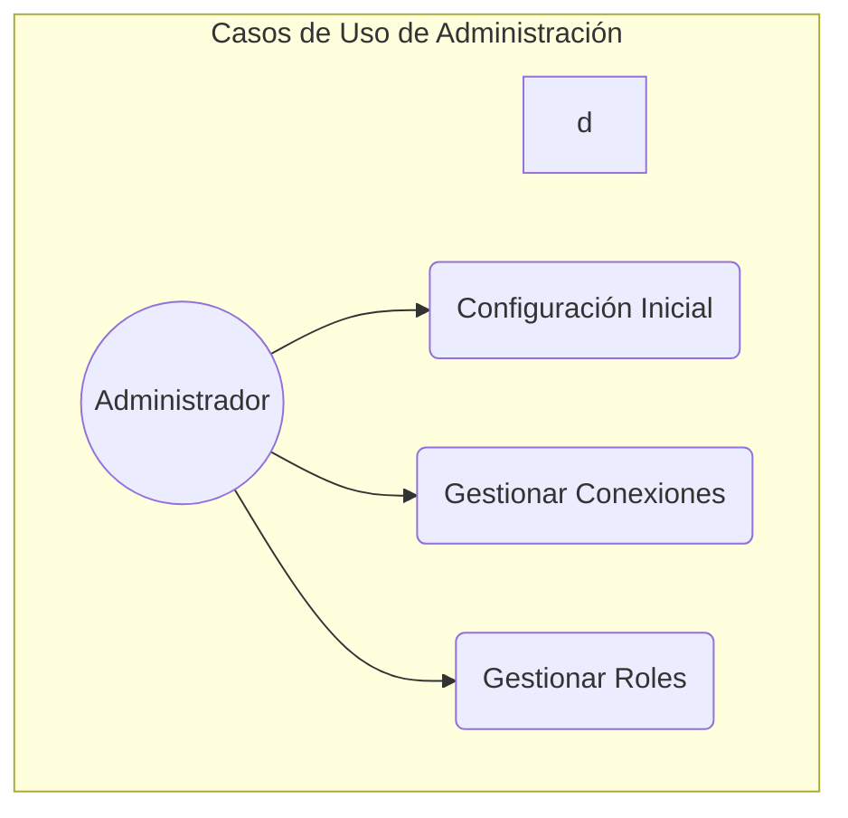
```mermaid
graph 
    subgraph "Casos de Uso de Administración"
        Administrador(("Administrador")) ~~~ F["d"]:::hidden
        Administrador --> CU0(Configuración Inicial)
        Administrador --> CU3(Gestionar Conexiones)
        Administrador --> CU4(Gestionar Roles)
    end
```

### 10.3. Casos de Uso de Consulta (Roles: Engineering Manager, Tech Lead, Desarrollador)

| Caso de Uso | Actor Principal | Resumen |
| :--- | :--- | :--- |
| **Consultar Métricas** | Engineering Manager, Tech Lead, Desarrollador | El usuario visualiza los dashboards de métricas DORA. La vista y el alcance de los datos presentados se adaptan automáticamente según el rol del usuario. |

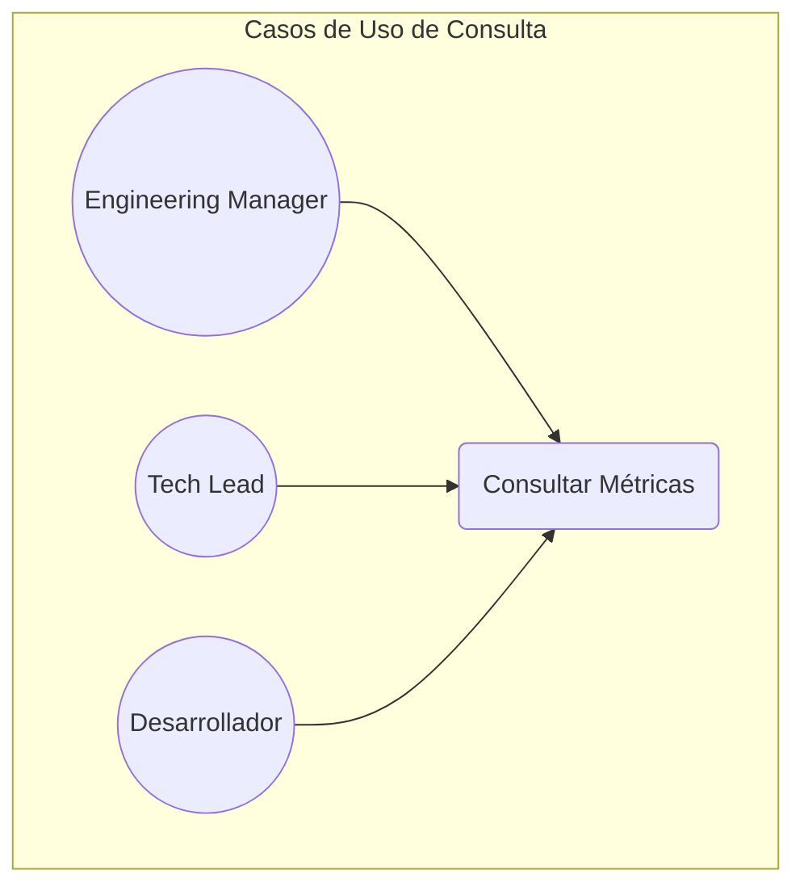
```mermaid
graph
    subgraph "Casos de Uso de Consulta"
        EM(("Engineering Manager"))
        TL(("Tech Lead"))
        Desarrollador(("Desarrollador"))
        
        EM --> CU6(Consultar Métricas)
        TL --> CU6
        Desarrollador --> CU6
    end
```

### 10.4. Casos de Uso del Sistema (Procesos Automatizados)

| Caso de Uso | Actor Principal | Resumen |
| :--- | :--- | :--- |
| **Disparar Notificación de Alerta** | Sistema | El sistema envía una notificación por correo electrónico cuando detecta una desviación significativa en una métrica calculada. |

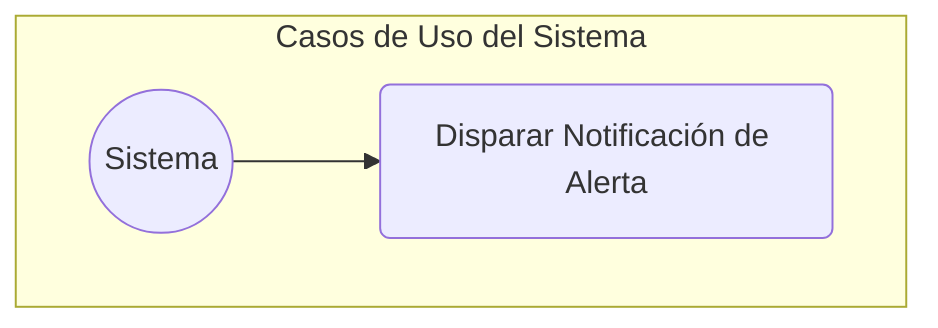
```mermaid
graph
    subgraph "Casos de Uso del Sistema"
        Sistema(("Sistema"))
        Sistema --> CU7(Disparar Notificación de Alerta)
    end
```

---

## 11. Detalle de Historias de Usuario

* **HU-1: Iniciar Sesión**
    - **Como** un usuario no autenticado, **quiero** poder iniciar sesión con mi cuenta de GitHub, **para** acceder a la aplicación de forma segura.
    - **AC 1.1:** Dado que no estoy logueado, cuando hago clic en "Iniciar Sesión con GitHub", entonces soy redirigido a la página de autorización de GitHub.
    - **AC 1.2:** Dado que he autorizado la aplicación en GitHub, cuando soy redirigido de vuelta, entonces debo ver el dashboard principal y mi sesión debe estar activa.
    - **AC 1.3:** Dado que no soy miembro de la organización configurada, cuando intento iniciar sesión, entonces veo un mensaje de error de "Acceso Denegado".

* **HU-2: Cerrar Sesión**
    - **Como** un usuario autenticado, **quiero** poder cerrar mi sesión, **para** proteger mi cuenta cuando termine de usar la aplicación.
    - **AC 2.1:** Dado que estoy logueado, cuando hago clic en "Cerrar Sesión", entonces mi sesión se invalida y soy redirigido a la página de inicio de sesión.

* **HU-3: Configuración Inicial**
    - **Como** el primer usuario de la aplicación, **quiero** ser asignado automáticamente como Administrador, **para** poder realizar la configuración inicial del sistema.
    - **AC 3.1:** Dado que la aplicación no tiene una organización configurada ni administradores, cuando inicio sesión por primera vez, entonces mi usuario es creado con el rol de "Administrador".
    - **AC 3.2:** Dado que soy el primer administrador, después de iniciar sesión, entonces soy redirigido a la página de "Configuración del Sistema".

* **HU-4: Gestionar Conexiones (Backend)**
    - **Como** Administrador, **quiero** que el sistema pueda usar las credenciales de conexión, **para** que el sistema pueda recolectar datos.
    - **AC 4.1:** Dado que estoy en la página de configuración, cuando introduzco una clave de API válida y la guardo, entonces veo un mensaje de confirmación y la clave se almacena de forma cifrada.
    - **AC 4.2:** Dado que estoy en la página de configuración, cuando introduzco el nombre de la organización de GitHub y guardo, entonces el sistema valida que la aplicación tiene acceso a esa organización antes de guardar.

* **HU-5: Gestionar Roles**
    - **Como** Administrador, **quiero** poder ver una lista de todos los usuarios pertenecientes a la organización y asignarles roles, **para** controlar el acceso a la aplicación.
    - **AC 5.1:** Dado que estoy en la página de gestión de usuarios, cuando la página carga, entonces veo una tabla con todos los miembros de la organización de GitHub sincronizados.
    - **AC 5.2:** Dado que estoy viendo la lista de usuarios, entonces cada usuario que no tiene un rol explícitamente asignado se muestra con el rol por defecto "Desarrollador".
    - **AC 5.3:** Dado que estoy en la página de gestión de usuarios, cuando selecciono un usuario y le asigno el rol "Tech Lead", entonces el cambio se persiste y se refleja en la lista.
    - **AC 5.4:** Dado que estoy en la página de gestión de usuarios, cuando selecciono un usuario y le asigno el rol "Engineering Manager", entonces el cambio se persiste y se refleja en la lista.
    - **AC 5.5:** Dado que estoy en la página de gestión de usuarios, cuando selecciono un usuario y le asigno el rol "Administrador", entonces el cambio se persiste y se refleja en la lista.

* **HU-6: Dashboard de Engineering Manager**
    - **Como** Engineering Manager, **quiero** ver un dashboard con las métricas DORA agregadas a nivel de toda la organización, **para** entender el rendimiento general de la ingeniería.
    - **AC 6.1:** Dado que he iniciado sesión como Engineering Manager, cuando accedo al dashboard, entonces los gráficos muestran por defecto los datos de todos los equipos.
    - **AC 6.2:** Dado que estoy viendo el dashboard, cuando uso el filtro de equipo y selecciono "Equipo Alfa", entonces todos los gráficos se actualizan para mostrar solo los datos del "Equipo Alfa".

* **HU-7: Dashboard de Tech Lead**
    - **Como** Tech Lead, **quiero** ver un dashboard con las métricas DORA específicas de mi equipo y sus repositorios, **para** monitorear la salud y la eficiencia de mi equipo.
    - **AC 7.1:** Dado que he iniciado sesión como Tech Lead del "Equipo Beta", cuando accedo al dashboard, entonces solo veo los datos del "Equipo Beta".
    - **AC 7.2:** Dado que soy Tech Lead, cuando veo el dashboard, entonces no tengo la opción de filtrar por otros equipos.

* **HU-8: Dashboard de Desarrollador**
    - **Como** Desarrollador, **quiero** ver un dashboard con las métricas DORA de los repositorios en los que contribuyo, **para** entender el impacto de mi trabajo en el ciclo de entrega.
    - **AC 8.1:** Dado que he iniciado sesión como Desarrollador, cuando accedo al dashboard, entonces los gráficos muestran por defecto los datos de todos los repositorios en los que he hecho commits.

* **HU-9: Enviar Notificación de Alerta de Métrica**
    * **Como** el sistema, **quiero** enviar una notificación por correo electrónico, **para** alertar a los usuarios relevantes sobre cambios significativos en el rendimiento.
    * **AC 9.1:** Dado que el `module-processor` ha calculado una nueva métrica, cuando el valor de esta métrica excede un umbral predefinido, entonces se dispara un evento de notificación.
    * **AC 9.2:** Dado que se ha disparado un evento de notificación, cuando el `module-notifications` lo recibe, entonces se envía un correo electrónico al Tech Lead o Engineering Manager responsable del repositorio o equipo afectado.

* **HU-10: Recolectar Datos de GitHub**
    * **Como** el sistema, **quiero** conectarme a la API de GitHub de forma periódica, **para** recolectar eventos de PRs, commits y deployments.
    * **AC 10.1:** Dado que la aplicación se inicia y el esquema de la base de datos es gestionado por JPA/Hibernate.
      Cuando un desarrollador inspecciona el esquema de la base de datos.
      Entonces las tablas REPOSITORY_CONFIG y SYNC_STATUS deben existir con sus columnas correctamente definidas, listas para ser usadas por los servicios de sincronización.
    * **AC 10.2:** Dado que el framework de sincronización está implementado y existe una configuración de repositorio.
      Cuando se ejecuta el CommitSyncService.
      Entonces los nuevos commits del repositorio de GitHub se guardan en la tabla COMMIT, y la tabla SYNC_STATUS se actualiza con la nueva fecha de lastSuccessfulRun para el job "COMMIT_SYNC".
    * **AC 10.3:** Dado que el framework de sincronización está implementado.
      Cuando se ejecuta el PullRequestSyncService.
      Entonces los nuevos Pull Requests del repositorio de GitHub se guardan en la base de datos, y la tabla SYNC_STATUS se actualiza para el job "PULL_REQUEST_SYNC".
    * **AC 10.4:** Dado que el framework está implementado y la aplicación está configurada con el nombre del workflow de despliegue.
      Cuando se ejecuta el DeploymentSyncService.
      Entonces las nuevas ejecuciones exitosas de dicho workflow se guardan como registros de Deployment, y la tabla SYNC_STATUS se actualiza para el job "DEPLOYMENT_SYNC".

* **HU-11: Procesar Métricas de Velocidad**
    * **Como** el sistema, **quiero** procesar los datos de GitHub, **para** calcular la Frecuencia de Despliegue y el Tiempo de Espera para Cambios.
    * **AC 11.1:** Dado que hay eventos de despliegue y commits en la base de datos, cuando el job de procesamiento se ejecuta, entonces se calcula y guarda correctamente la métrica de Frecuencia de Despliegue.
    * **AC 11.2:** Dado que hay eventos de commits y PRs, cuando el job de procesamiento se ejecuta, entonces se calcula y guarda correctamente la métrica de Tiempo de Espera para Cambios.

* **HU-12: Recolectar Datos de Jira**
    * **Como** el sistema, **quiero** conectarme a la API de Jira de forma periódica, **para** enriquecer los datos de los commits.
    * **AC 12.1:** Dado que el job de recolección se ejecuta, cuando se conecta a la API de Jira, entonces obtiene los datos de los tickets mencionados en los commits.
    * **AC 12.2:** Dado que se obtiene un evento de Jira, cuando se intenta guardar en la base de datos, entonces se previene la inserción de duplicados.

* **HU-13: Recolectar Datos de DataDog**
    * **Como** el sistema, **quiero** conectarme a la API de DataDog de forma periódica, **para** recolectar eventos de incidentes.
    * **AC 13.1:** Dado que el job de recolección se ejecuta, cuando se conecta a la API de DataDog, entonces obtiene los incidentes nuevos y los guarda en la base de datos.
    * **AC 13.2:** Dado que se obtiene un incidente de DataDog, cuando se intenta guardar en la base de datos, entonces se previene la inserción de duplicados.

* **HU-14: Procesar Métricas de Estabilidad**
    * **Como** el sistema, **quiero** procesar los datos de despliegues e incidentes, **para** calcular la Tasa de Fallo de Cambio y el Tiempo Medio de Recuperación.
    * **AC 14.1:** Dado que hay eventos de despliegues e incidentes, cuando el job de procesamiento se ejecuta, entonces se calcula y guarda correctamente la métrica de Tasa de Fallo de Cambio.
    * **AC 14.2:** Dado que hay eventos de incidentes, cuando el job de procesamiento se ejecuta, entonces se calcula y guarda correctamente la métrica de Tiempo Medio de Recuperación.

* **HU-15: Estructura Base del Frontend**
    * **Como** desarrollador, **quiero** una estructura de proyecto React con ruteo y layouts, **para** tener una base sólida sobre la cual construir la UI.
    * **AC 15.1:** Dado que la aplicación carga, cuando un usuario no está autenticado, entonces se le muestra la `LoginPage`.
    * **AC 15.2:** Dado que un usuario está autenticado, cuando navega por la aplicación, entonces ve el `AuthenticatedLayout` (header y sidebar) de forma persistente.

* **HU-16: Página de Administración de Roles**
    * **Como** Administrador, **quiero** una interfaz para gestionar los roles de los usuarios, **para** controlar los permisos de la aplicación.
    * **AC 16.1:** Dado que he iniciado sesión como Administrador, cuando navego a la página de administración, entonces veo una tabla con los usuarios de la organización.
    - **AC 16.2:** Dado que estoy viendo la tabla de usuarios, cuando cambio el rol de un usuario, entonces se realiza una llamada a la API y la UI se actualiza con el nuevo rol.

* **HU-17: Implementar un Modelo de Acceso "Cerrado por Defecto" en el Arranque**
    * **Como** administrador del sistema, **necesito** que la aplicación bloquee por defecto todos los inicios de sesión, excepto el del administrador inicial designado, cuando aún no he configurado una organización de GitHub, **para** garantizar la máxima seguridad desde el primer despliegue y prevenir cualquier registro de usuario no autorizado antes de que el sistema esté completamente configurado.
    * **AC 17.1:** Dado que el sistema está en su estado de arranque inicial, cuando un usuario que no es el administrador inicial intenta iniciar sesión, entonces el acceso debe ser denegado.
    * **AC 17.2:** Dado que el sistema está en su estado de arranque inicial, cuando el usuario que es el administrador inicial intenta iniciar sesión, entonces debe ser creado exitosamente con el rol de ADMIN.
    * **AC 17.3:** Dado que un ADMIN ya existe en el sistema y la organización aún no está configurada, cuando un nuevo usuario intenta iniciar sesión, entonces su acceso debe ser denegado.

* **HU-18: Interfaz de Usuario para Cerrar Sesión**
    * **Como** usuario autenticado, **quiero** poder cerrar mi sesión de forma segura, **para** proteger mi cuenta de accesos no autorizados.
    * **AC 18.1:** Dado que he iniciado sesión, cuando navego por la aplicación, entonces veo un elemento claramente identificable para "Cerrar Sesión".
    * **AC 18.2:** Dado que estoy viendo el botón "Cerrar Sesión", cuando hago clic en él, entonces soy redirigido inmediatamente a la página de inicio (`/`).
    * **AC 18.3:** Dado que he cerrado sesión, cuando intento acceder a una ruta protegida, entonces se me deniega el acceso y soy redirigido a la página de inicio de sesión.

* **HU-19: Crear Página de Inicio de Sesión**
    * **Como** usuario no autenticado, **quiero** ver una página de bienvenida simple que me invite a iniciar sesión con mi cuenta de GitHub para poder acceder a la aplicación.
    * **AC 19.1:** Dado que no he iniciado sesión, cuando visito la raíz de la aplicación (`/`), entonces se me presenta una página de bienvenida.
    * **AC 19.2:** Dado que estoy en la página de bienvenida, cuando hago clic en el botón "Iniciar Sesión con GitHub", entonces soy redirigido al flujo de autorización de GitHub.

* **HU-20: Crear Página Principal (Home) para Usuarios Autenticados**
    * **Como** usuario que ha iniciado sesión, **quiero** ser dirigido a una página principal o "Home" donde pueda ver contenido exclusivo y acceder a acciones como "Cerrar Sesión".
    * **AC 20.1:** Dado que he completado el inicio de sesión con éxito, cuando soy redirigido por el sistema, entonces aterrizo en una URL protegida (ej. `/home` o `/dashboard`).
    * **AC 20.2:** Dado que estoy en la página principal, cuando observo el contenido, entonces veo un mensaje de bienvenida simple y el botón "Cerrar Sesión".

---

## 12. Diseño del Frontend

### 12.1. Framework y Herramientas
- **Framework:** **React (con Vite)**. Se elige React por su robusto ecosistema, su modelo de componentes declarativo y el amplio soporte de la comunidad. Vite se utilizará como herramienta de build por su experiencia de desarrollo extremadamente rápida (Hot Module Replacement).
- **Lenguaje:** **TypeScript**. Para añadir seguridad de tipos y mejorar la mantenibilidad del código.
- **Estilos:** **Tailwind CSS**. Un framework CSS "utility-first" que permite construir diseños complejos rápidamente sin salir del HTML, promoviendo la consistencia visual.
- **Librería de Componentes:** **Shadcn/UI**. Para acelerar el desarrollo de la UI, se utilizará esta librería de componentes accesibles y componibles que se integra perfectamente con Tailwind CSS.
- **Gestión de Estado:**
    - **Estado Global de UI:** **React Context API con Hooks**. Para gestionar el estado de la sesión del usuario (información del usuario, rol), que es global y cambia con poca frecuencia.
      ***Nota de Implementación (MVP):*** *En la implementación actual, el estado del usuario se obtiene localmente en los componentes que lo necesitan (ej. `HomePage`) usando `useState` y `useEffect`. Se introducirá un `AuthContext` global cuando múltiples componentes no relacionados necesiten acceder a esta información, para evitar llamadas redundantes a la API.*
    - **Estado del Servidor:** **TanStack Query (React Query)**. Para gestionar todo el ciclo de vida de las peticiones a la API: fetching, caching, sincronización y actualización de datos del servidor.
      ***Nota de Implementación (MVP):*** *Para las funcionalidades iniciales, las llamadas a la API se están gestionando directamente con `useState` y `useEffect`. Esta decisión simplifica la configuración inicial. Se planea introducir `TanStack Query` en fases posteriores, especialmente para la implementación de los dashboards, donde sus capacidades de cacheo y sincronización automática serán más beneficiosas.*

***Nota de Diseño (Monolito Frontend vs. Microfrontends):*** *Para el alcance del MVP, se ha elegido un enfoque de **monolito de frontend**. Esta decisión prioriza la velocidad de desarrollo y la simplicidad operativa. Una evolución futura para una organización con múltiples equipos de frontend podría ser la descomposición de la aplicación en **microfrontends** (ej. un microfrontend para la administración y otro para los dashboards) para permitir un desarrollo y despliegue independientes.*

### 12.2. Estructura de Componentes Principales
La aplicación se organizará en una jerarquía de componentes reutilizables.

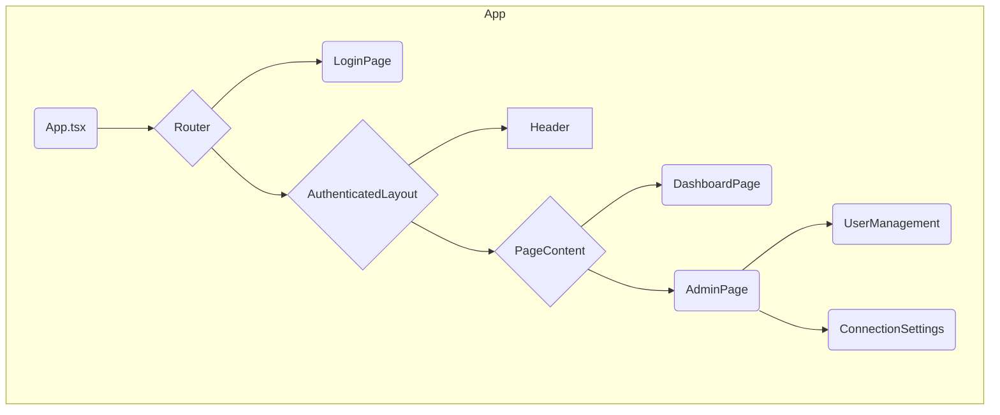
```mermaid
graph TD
    subgraph "App"
        A(App.tsx) --> B{Router};
        B --> C(LoginPage);
        B --> D{AuthenticatedLayout};
        D --> E[Header];
        D --> G{PageContent};
        G --> H(DashboardPage);
        G --> I(AdminPage);
        I --> J(UserManagement);
        I --> K(ConnectionSettings);
    end
```

- **`App.tsx`**: El componente raíz que inicializa la aplicación.
- **`Router`**: Gestiona las rutas de la aplicación (ej. `/login`, `/home`, `/admin`).
- **`LoginPage`**: Página de inicio de sesión, visible para usuarios no autenticado.
- **`AuthenticatedLayout`**: Un componente "wrapper" que define la estructura común para las páginas protegidas (Header, etc.).
- **`Header`**: Muestra el nombre de la aplicación y el botón de "Cerrar Sesión".
- **`Sidebar`**: ***(Trabajo Futuro)*** Contendrá los enlaces de navegación principal (ej. "Dashboard", "Administración"). La visibilidad de los enlaces dependerá del rol del usuario. En el MVP actual, la navegación se limita a la cabecera.
- **`DashboardPage`**: La página principal que contendrá los paneles de Grafana embebidos. Su contenido se adaptará según el rol del usuario (EM, TL, Dev).
- **`AdminPage`**: Una página que contendrá las herramientas de administración.
- **`UserManagement`**: Componente para la gestión de roles de usuario (visible solo para Admins).
- **`ConnectionSettings`**: Componente para gestionar las conexiones a las APIs externas (visible solo para Admins).

### 12.3. Flujo de Datos y Estado
1.  Al iniciar sesión, el backend establece una **cookie de sesión `HttpOnly`**.
2.  Los componentes que necesitan datos del servidor (ej. `HomePage`) utilizan el hook `useEffect` para ejecutar una llamada `fetch` cuando se montan.
3.  La petición `fetch` se configura con la opción **`credentials: 'include'`** para asegurar que la cookie de sesión se envíe al backend.
4.  La respuesta de la API se almacena en el estado local del componente usando el hook `useState`, y la UI se actualiza para mostrar los datos. Los estados de carga y error se gestionan también con `useState`.

### 12.4. Estrategia de Implementación por Fases
La construcción del frontend seguirá un enfoque pragmático en tres fases principales:

* **Fase 1: La Fundación - Flujo de Sesión Completo (HU-15, HU-18, HU-19, HU-20)**
  El objetivo es tener una aplicación donde un usuario pueda entrar, ser reconocido y salir.

    1. **Configuración y Página de Aterrizaje:** Crear el proyecto React, configurar las herramientas y construir la `LoginPage` con el botón de login.

    2. **Rutas Protegidas y Contexto de Autenticación:** Implementar el `Router` y el `AuthenticatedLayout`. Este último verificará la sesión del usuario llamando a un endpoint `/api/user/me` y gestionará la redirección a la página de login si no está autenticado.

    3. **Página Principal y Cierre de Sesión:** Crear una página principal simple y el `Header` con la información del usuario y el botón de logout funcional.

* **Fase 2: El Panel de Administración (HU-16)**
  El objetivo es construir la funcionalidad que requiere más interacción con la API (lectura y escritura).

    1. **Crear Componentes de UI:** Construir la `AdminPage` y el componente `UserManagement` utilizando componentes de Shadcn/UI (como la tabla).

    2. **Integrar con TanStack Query:** Usar `useQuery` para leer la lista de usuarios y `useMutation` para actualizar los roles, asegurando que la UI se actualice automáticamente.

* **Fase 3: Los Dashboards (HU-6, 7, 8)**
  El objetivo es integrar la visualización de datos.

    1. **Crear `DashboardPage`:** Este componente consumirá el `AuthContext` para obtener el rol del usuario.

    2. **Integrar Grafana:** Embeber los paneles de Grafana usando un `iframe`.

    3. **Hacer Dashboards Dinámicos:** Construir la URL del `iframe` dinámicamente basándose en el rol del usuario para mostrar la vista de datos correcta.

---

## Apéndice A: Diagramas de Diseño Detallado

### A.1:

### Diagrama de clases
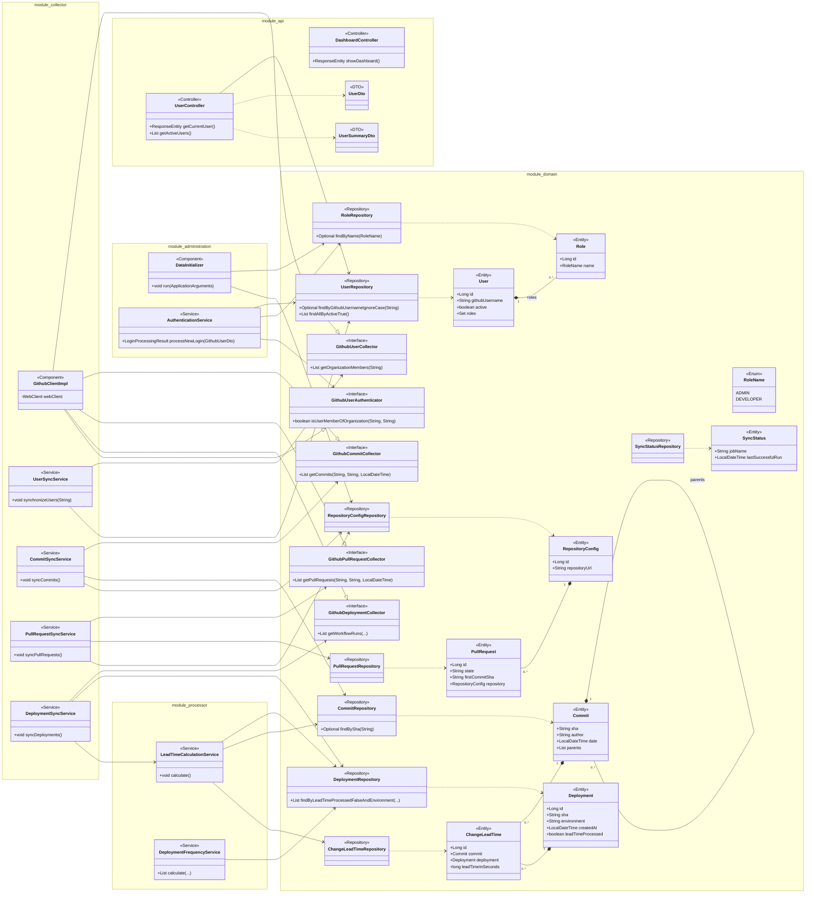
```mermaid
classDiagram
    direction LR

    namespace module_domain {
        class User {
            <<Entity>>
            +Long id
            +String githubUsername
            +boolean active
            +Set<Role> roles
        }
        class Role {
            <<Entity>>
            +Long id
            +RoleName name
        }
        class RoleName {
            <<Enum>>
            ADMIN
            DEVELOPER
        }
        class Commit {
            <<Entity>>
            +String sha
            +String author
            +LocalDateTime date
            +List<Commit> parents
        }
        class Deployment {
            <<Entity>>
            +Long id
            +String sha
            +String environment
            +LocalDateTime createdAt
            +boolean leadTimeProcessed
        }
        class PullRequest {
            <<Entity>>
            +Long id
            +String state
            +String firstCommitSha
            +RepositoryConfig repository
        }
        class RepositoryConfig {
            <<Entity>>
            +Long id
            +String repositoryUrl
        }
        class ChangeLeadTime {
            <<Entity>>
            +Long id
            +Commit commit
            +Deployment deployment
            +long leadTimeInSeconds
        }
        class SyncStatus {
            <<Entity>>
            +String jobName
            +LocalDateTime lastSuccessfulRun
        }

        class UserRepository {
            <<Repository>>
            +Optional<User> findByGithubUsernameIgnoreCase(String)
            +List<User> findAllByActiveTrue()
        }
        class RoleRepository {
            <<Repository>>
            +Optional<Role> findByName(RoleName)
        }
        class CommitRepository {
            <<Repository>>
            +Optional<Commit> findBySha(String)
        }
        class DeploymentRepository {
            <<Repository>>
            +List<Deployment> findByLeadTimeProcessedFalseAndEnvironment(...)
        }
        class PullRequestRepository {
            <<Repository>>
        }
        class RepositoryConfigRepository {
            <<Repository>>
        }
        class ChangeLeadTimeRepository {
            <<Repository>>
        }
        class SyncStatusRepository {
            <<Repository>>
        }

        class GithubUserCollector {
            <<Interface>>
            +List<OrganizationMember> getOrganizationMembers(String)
        }
        class GithubCommitCollector {
            <<Interface>>
            +List<GithubCommitDto> getCommits(String, String, LocalDateTime)
        }
        class GithubPullRequestCollector {
            <<Interface>>
            +List<GithubPullRequestDto> getPullRequests(String, String, LocalDateTime)
        }
        class GithubDeploymentCollector {
            <<Interface>>
            +List<GitHubWorkflowRunDto> getWorkflowRuns(...)
        }
        class GithubUserAuthenticator {
            <<Interface>>
            +boolean isUserMemberOfOrganization(String, String)
        }
    }

    namespace module_collector {
        class GithubClientImpl {
            <<Component>>
            -WebClient webClient
        }
        class UserSyncService {
            <<Service>>
            +void synchronizeUsers(String)
        }
        class CommitSyncService {
            <<Service>>
            +void syncCommits()
        }
        class PullRequestSyncService {
            <<Service>>
            +void syncPullRequests()
        }
        class DeploymentSyncService {
            <<Service>>
            +void syncDeployments()
        }
    }

    namespace module_processor {
        class LeadTimeCalculationService {
            <<Service>>
            +void calculate()
        }
        class DeploymentFrequencyService {
            <<Service>>
            +List<DeploymentFrequency> calculate(...)
        }
    }

    namespace module_api {
        class UserController {
            <<Controller>>
            +ResponseEntity<UserDto> getCurrentUser()
            +List<UserSummaryDto> getActiveUsers()
        }
        class DashboardController {
            <<Controller>>
            +ResponseEntity<String> showDashboard()
        }
        class UserDto { <<DTO>> }
        class UserSummaryDto { <<DTO>> }
    }

    namespace module_administration {
        class DataInitializer {
            <<Component>>
            +void run(ApplicationArguments)
        }
        class AuthenticationService {
            <<Service>>
            +LoginProcessingResult processNewLogin(GithubUserDto)
        }
    }

%% --- Relationships ---

%% module_domain relationships
    User "1" *-- "0..*" Role : roles
    Commit "1" *-- "0..*" Commit : parents
    PullRequest "0..*" --* "1" RepositoryConfig
    ChangeLeadTime "0..*" --* "1" Commit
    ChangeLeadTime "0..*" --* "1" Deployment

%% Dependencies within module_domain
    UserRepository ..> User
    RoleRepository ..> Role
    CommitRepository ..> Commit
    DeploymentRepository ..> Deployment
    PullRequestRepository ..> PullRequest
    RepositoryConfigRepository ..> RepositoryConfig
    ChangeLeadTimeRepository ..> ChangeLeadTime
    SyncStatusRepository ..> SyncStatus

%% module_collector relationships
    GithubClientImpl --|> GithubUserCollector
    GithubClientImpl --|> GithubCommitCollector
    GithubClientImpl --|> GithubPullRequestCollector
    GithubClientImpl --|> GithubDeploymentCollector
    GithubClientImpl --|> GithubUserAuthenticator

    UserSyncService --> GithubUserCollector
    UserSyncService --> UserRepository

    CommitSyncService --> GithubCommitCollector
    CommitSyncService --> CommitRepository
    CommitSyncService --> RepositoryConfigRepository

    PullRequestSyncService --> GithubPullRequestCollector
    PullRequestSyncService --> PullRequestRepository
    PullRequestSyncService --> RepositoryConfigRepository

    DeploymentSyncService --> GithubDeploymentCollector
    DeploymentSyncService --> DeploymentRepository
    DeploymentSyncService --> LeadTimeCalculationService

%% module_processor relationships
    LeadTimeCalculationService --> DeploymentRepository
    LeadTimeCalculationService --> CommitRepository
    LeadTimeCalculationService --> ChangeLeadTimeRepository
    DeploymentFrequencyService --> DeploymentRepository

%% module_api relationships
    UserController --> UserRepository
    UserController ..> UserDto
    UserController ..> UserSummaryDto

%% module_administration relationships
    DataInitializer --> RoleRepository
    DataInitializer --> RepositoryConfigRepository
    AuthenticationService --> UserRepository
    AuthenticationService --> RoleRepository
    AuthenticationService --> GithubUserAuthenticator
```


### Modelo Físico de Base de Datos (ERD)

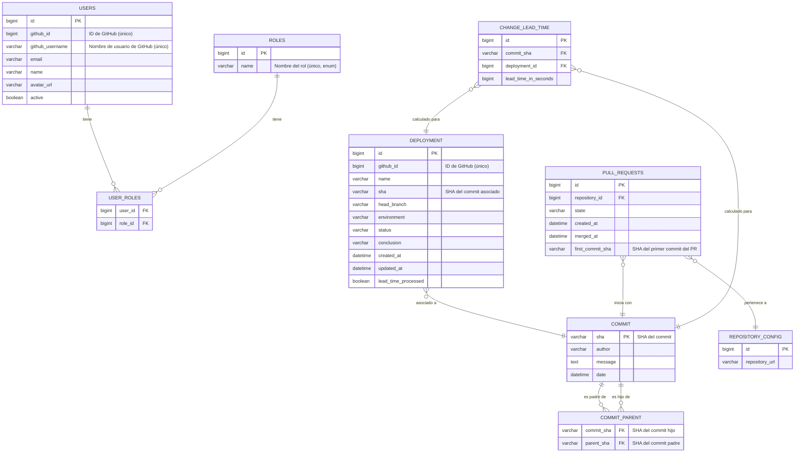
```mermaid
erDiagram
    USERS {
        bigint id PK
        bigint github_id "ID de GitHub (único)"
        varchar github_username "Nombre de usuario de GitHub (único)"
        varchar email
        varchar name
        varchar avatar_url
        boolean active
    }

    ROLES {
        bigint id PK
        varchar name "Nombre del rol (único, enum)"
    }

    USER_ROLES {
        bigint user_id FK
        bigint role_id FK
    }

    COMMIT {
        varchar sha PK "SHA del commit"
        varchar author
        text message
        datetime date
    }

    COMMIT_PARENT {
        varchar commit_sha FK "SHA del commit hijo"
        varchar parent_sha FK "SHA del commit padre"
    }

    DEPLOYMENT {
        bigint id PK
        bigint github_id "ID de GitHub (único)"
        varchar name
        varchar sha "SHA del commit asociado"
        varchar head_branch
        varchar environment
        varchar status
        varchar conclusion
        datetime created_at
        datetime updated_at
        boolean lead_time_processed
    }

    REPOSITORY_CONFIG {
        bigint id PK
        varchar repository_url
    }

    PULL_REQUESTS {
        bigint id PK
        bigint repository_id FK
        varchar state
        datetime created_at
        datetime merged_at
        varchar first_commit_sha "SHA del primer commit del PR"
    }

    CHANGE_LEAD_TIME {
        bigint id PK
        varchar commit_sha FK
        bigint deployment_id FK
        bigint lead_time_in_seconds
    }

    USERS ||--o{ USER_ROLES : "tiene"
    ROLES ||--o{ USER_ROLES : "tiene"
    COMMIT ||--o{ COMMIT_PARENT : "es padre de"
    COMMIT_PARENT }o--|| COMMIT : "es hijo de"
    DEPLOYMENT }o--|| COMMIT : "asociado a"
    PULL_REQUESTS }o--|| REPOSITORY_CONFIG : "pertenece a"
    PULL_REQUESTS }o--|| COMMIT : "inicia con"
    CHANGE_LEAD_TIME }o--|| COMMIT : "calculado para"
    CHANGE_LEAD_TIME }o--|| DEPLOYMENT : "calculado para"
```

# Diccionario de Datos

A continuación se detallan las tablas que componen la base de datos de la solución, junto con sus respectivas columnas y descripciones.

### Tabla: `USERS`
Almacena la información de los usuarios sincronizados desde GitHub.

| Columna           | Tipo de Dato | Descripción                                            |
|-------------------|--------------|--------------------------------------------------------|
| `id`              | `bigint`     | Identificador único de la entidad (PK).                |
| `github_id`       | `bigint`     | ID único del usuario en GitHub.                        |
| `github_username` | `varchar`    | Nombre de usuario en GitHub.                           |
| `email`           | `varchar`    | Correo electrónico del usuario.                        |
| `name`            | `varchar`    | Nombre completo del usuario.                           |
| `avatar_url`      | `varchar`    | URL del avatar del usuario en GitHub.                  |
| `active`          | `boolean`    | Indica si el usuario está activo en la organización.   |

### Tabla: `ROLES`
Define los roles que pueden ser asignados a los usuarios.

| Columna | Tipo de Dato | Descripción                               |
|---------|--------------|-------------------------------------------|
| `id`    | `bigint`     | Identificador único de la entidad (PK).   |
| `name`  | `varchar`    | Nombre del rol (ej. `ADMIN`, `DEVELOPER`). |

### Tabla: `USER_ROLES`
Tabla de unión para la relación muchos a muchos entre `USERS` y `ROLES`.

| Columna   | Tipo de Dato | Descripción                               |
|-----------|--------------|-------------------------------------------|
| `user_id` | `bigint`     | Clave foránea que referencia a `USERS.id`.  |
| `role_id` | `bigint`     | Clave foránea que referencia a `ROLES.id`.  |

### Tabla: `COMMIT`
Almacena información de los commits de los repositorios configurados.

| Columna  | Tipo de Dato | Descripción                                   |
|----------|--------------|-----------------------------------------------|
| `sha`    | `varchar`    | Hash SHA del commit (PK).                     |
| `author` | `varchar`    | Autor del commit.                             |
| `message`| `text`       | Mensaje del commit.                           |
| `date`   | `datetime`   | Fecha y hora en que se realizó el commit.     |

### Tabla: `COMMIT_PARENT`
Tabla de unión para la relación de paternidad (muchos a muchos) entre commits.

| Columna      | Tipo de Dato | Descripción                                    |
|--------------|--------------|------------------------------------------------|
| `commit_sha` | `varchar`    | Clave foránea que referencia al commit hijo.   |
| `parent_sha` | `varchar`    | Clave foránea que referencia al commit padre.  |

### Tabla: `DEPLOYMENT`
Registra los despliegues realizados a través de GitHub Actions.

| Columna               | Tipo de Dato | Descripción                                                     |
|-----------------------|--------------|-----------------------------------------------------------------|
| `id`                  | `bigint`     | Identificador único de la entidad (PK).                         |
| `github_id`           | `bigint`     | ID único del despliegue en GitHub.                              |
| `name`                | `varchar`    | Nombre del despliegue.                                          |
| `sha`                 | `varchar`    | SHA del commit que fue desplegado.                              |
| `head_branch`         | `varchar`    | Rama que se desplegó.                                           |
| `environment`         | `varchar`    | Entorno de despliegue (ej. `production`).                       |
| `status`              | `varchar`    | Estado del workflow de despliegue.                              |
| `conclusion`          | `varchar`    | Conclusión del workflow (ej. `success`, `failure`).             |
| `created_at`          | `datetime`   | Fecha y hora de creación del despliegue.                        |
| `updated_at`          | `datetime`   | Fecha y hora de la última actualización del despliegue.         |
| `lead_time_processed` | `boolean`    | Indica si el lead time para este despliegue ya fue calculado.   |

### Tabla: `REPOSITORY_CONFIG`
Almacena la configuración de los repositorios a monitorear.

| Columna          | Tipo de Dato | Descripción                               |
|------------------|--------------|-------------------------------------------|
| `id`             | `bigint`     | Identificador único de la entidad (PK).   |
| `repository_url` | `varchar`    | URL del repositorio de GitHub.            |

### Tabla: `PULL_REQUESTS`
Registra los Pull Requests de los repositorios configurados.

| Columna            | Tipo de Dato | Descripción                                                     |
|--------------------|--------------|-----------------------------------------------------------------|
| `id`               | `bigint`     | Identificador único de la entidad (PK).                         |
| `repository_id`    | `bigint`     | Clave foránea que referencia a `REPOSITORY_CONFIG.id`.          |
| `state`            | `varchar`    | Estado del Pull Request (ej. `open`, `closed`).                 |
| `created_at`       | `datetime`   | Fecha y hora de creación del Pull Request.                      |
| `merged_at`        | `datetime`   | Fecha y hora en que se fusionó el Pull Request.                 |
| `first_commit_sha` | `varchar`    | SHA del primer commit asociado al Pull Request.                 |

### Tabla: `CHANGE_LEAD_TIME`
Almacena los cálculos de la métrica "Lead Time for Changes".

| Columna                | Tipo de Dato | Descripción                                                     |
|------------------------|--------------|-----------------------------------------------------------------|
| `id`                   | `bigint`     | Identificador único de la entidad (PK).                         |
| `commit_sha`           | `varchar`    | Clave foránea que referencia al `COMMIT.sha` inicial.           |
| `deployment_id`        | `bigint`     | Clave foránea que referencia al `DEPLOYMENT.id` final.          |
| `lead_time_in_seconds` | `bigint`     | Tiempo total en segundos entre el primer commit y el despliegue.|


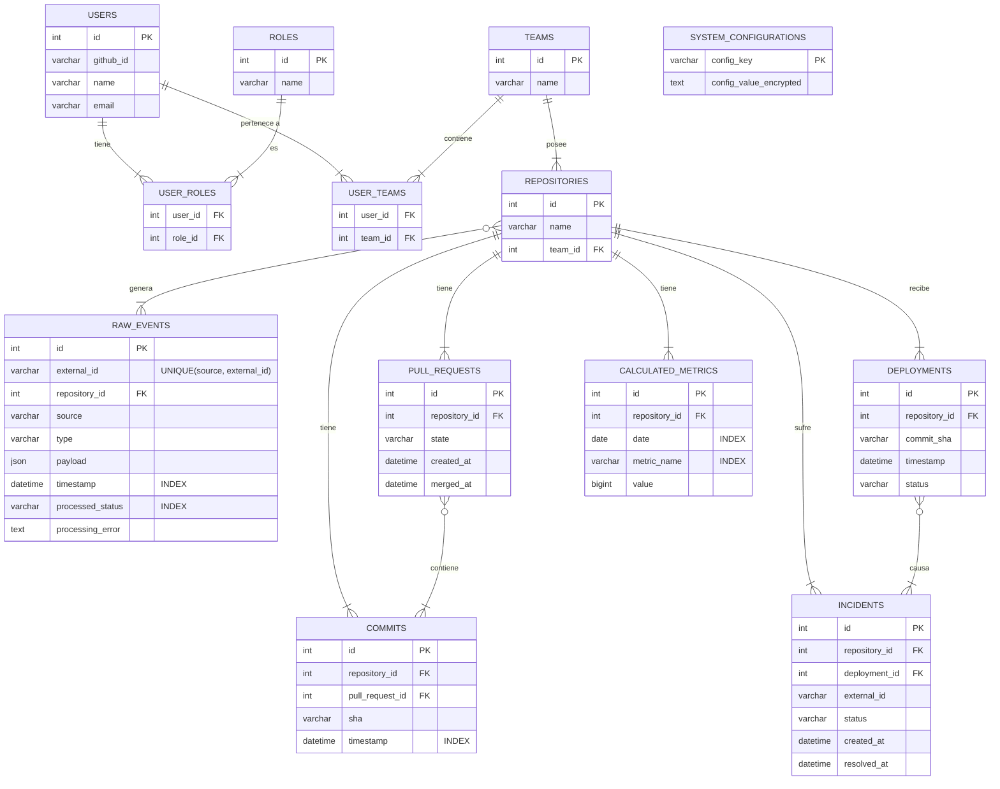
```mermaid
erDiagram
    USERS {
        int id PK
        varchar github_id
        varchar name
        varchar email
    }
    ROLES {
        int id PK
        varchar name
    }
    USER_ROLES {
        int user_id FK
        int role_id FK
    }
    TEAMS {
        int id PK
        varchar name
    }
    USER_TEAMS {
        int user_id FK
        int team_id FK
    }
    REPOSITORIES {
        int id PK
        varchar name
        int team_id FK
    }
    RAW_EVENTS {
        int id PK
        varchar external_id "UNIQUE(source, external_id)"
        int repository_id FK
        varchar source
        varchar type
        json payload
        datetime timestamp "INDEX"
        varchar processed_status "INDEX"
        text processing_error
    }
    PULL_REQUESTS {
        int id PK
        int repository_id FK
        varchar state
        datetime created_at
        datetime merged_at
    }
    COMMITS {
        int id PK
        int repository_id FK
        int pull_request_id FK
        varchar sha
        datetime timestamp "INDEX"
    }
    DEPLOYMENTS {
        int id PK
        int repository_id FK
        varchar commit_sha
        datetime timestamp
        varchar status
    }
    INCIDENTS {
        int id PK
        int repository_id FK
        int deployment_id FK
        varchar external_id
        varchar status
        datetime created_at
        datetime resolved_at
    }
    CALCULATED_METRICS {
        int id PK
        int repository_id FK
        date date "INDEX"
        varchar metric_name "INDEX"
        bigint value
    }
    SYSTEM_CONFIGURATIONS {
        varchar config_key PK
        text config_value_encrypted
    }

    USERS ||--|{ USER_ROLES : "tiene"
    ROLES ||--|{ USER_ROLES : "es"
    TEAMS ||--|{ REPOSITORIES : "posee"
    USERS ||--|{ USER_TEAMS : "pertenece a"
    TEAMS ||--|{ USER_TEAMS : "contiene"
    REPOSITORIES }o--|{ RAW_EVENTS : "genera"
    REPOSITORIES ||--|{ PULL_REQUESTS : "tiene"
    REPOSITORIES ||--|{ COMMITS : "tiene"
    REPOSITORIES ||--|{ DEPLOYMENTS : "recibe"
    PULL_REQUESTS }o--|{ COMMITS : "contiene"
    REPOSITORIES ||--|{ CALCULATED_METRICS : "tiene"
    REPOSITORIES ||--|{ INCIDENTS : "sufre"
    DEPLOYMENTS }o--|{ INCIDENTS : "causa"
```

### A.2: Diagramas de Implementación

#### HU-1: Iniciar Sesión

##### Diagrama de Clases
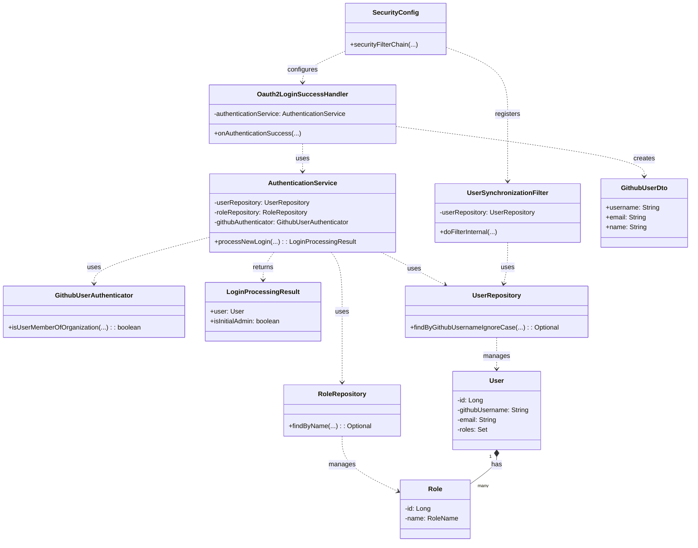
```mermaid
classDiagram
    direction LR

    subgraph module_api
        direction TB
        class SecurityConfig {
            +securityFilterChain(...)
        }
        class Oauth2LoginSuccessHandler {
            -authenticationService: AuthenticationService
            +onAuthenticationSuccess(...)
        }
        class UserSynchronizationFilter {
            -userRepository: UserRepository
            +doFilterInternal(...)
        }
    end

    subgraph module_administration
        direction TB
        class AuthenticationService {
            -userRepository: UserRepository
            -roleRepository: RoleRepository
            -githubAuthenticator: GithubUserAuthenticator
            +processNewLogin(...): LoginProcessingResult
        }
        class GithubUserAuthenticator {
            +isUserMemberOfOrganization(...): boolean
        }
        class GithubUserDto {
            +username: String
            +email: String
            +name: String
        }
        class LoginProcessingResult {
            +user: User
            +isInitialAdmin: boolean
        }
    end

    subgraph module_domain
        direction TB
        class User {
            -id: Long
            -githubUsername: String
            -email: String
            -roles: Set<Role>
        }
        class Role {
            -id: Long
            -name: RoleName
        }
        class UserRepository {
            +findByGithubUsernameIgnoreCase(...): Optional<User>
        }
        class RoleRepository {
            +findByName(...): Optional<Role>
        }
    end

    %% --- Relaciones ---
    SecurityConfig ..> Oauth2LoginSuccessHandler : configures
    SecurityConfig ..> UserSynchronizationFilter : registers

    Oauth2LoginSuccessHandler ..> AuthenticationService : uses
    Oauth2LoginSuccessHandler ..> GithubUserDto : creates
    AuthenticationService ..> LoginProcessingResult : returns

    AuthenticationService ..> UserRepository : uses
    AuthenticationService ..> RoleRepository : uses
    AuthenticationService ..> GithubUserAuthenticator : uses

    UserSynchronizationFilter ..> UserRepository : uses

    UserRepository ..> User : manages
    RoleRepository ..> Role : manages
    User "1" *-- "many" Role : has
```

##### Notas de Arquitectura

1.  **Flujo de Inicio de Sesión**: El flujo comienza con `Oauth2LoginSuccessHandler`, que delega la lógica de negocio a `AuthenticationService` en el `module_administration`, pasándole un DTO (`GithubUserDto`). El servicio devuelve un DTO de resultado (`LoginProcessingResult`) que el handler utiliza para decidir la redirección.
2.  **Sincronización de Sesión**: En cada petición subsecuente, `UserSynchronizationFilter` intercepta la llamada. Verifica que el usuario autenticado en la sesión exista en la base de datos. Si no existe (ej. por un reinicio de la BD en memoria), la sesión se invalida forzando una nueva autenticación. Esto asegura la integridad del sistema en todo momento.
3.  **Separación de Módulos**: El diagrama resalta la clara separación de responsabilidades:
    *   `module_api`: Maneja la configuración de seguridad web y los filtros HTTP.
    *   `module_administration`: Contiene la lógica de negocio de la autenticación y la gestión de usuarios.
    *   `module_domain`: Define las entidades de base de datos y sus repositorios.

##### Diagrama de Base de Datos (ERD)
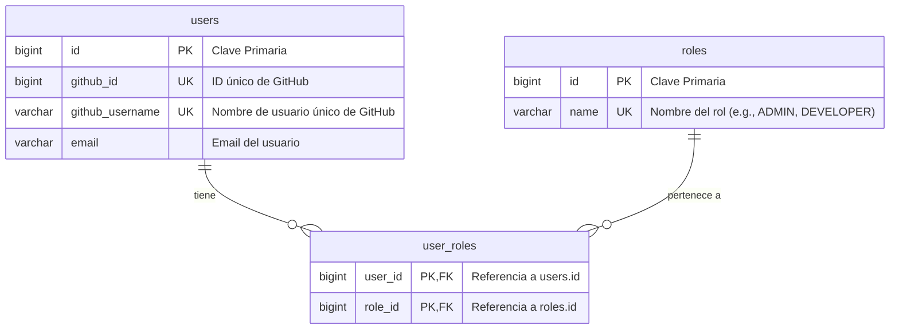
```mermaid
erDiagram
    users {
        bigint id PK "Clave Primaria"
        bigint github_id UK "ID único de GitHub"
        varchar github_username UK "Nombre de usuario único de GitHub"
        varchar email "Email del usuario"
    }

    roles {
        bigint id PK "Clave Primaria"
        varchar name UK "Nombre del rol (e.g., ADMIN, DEVELOPER)"
    }

    user_roles {
        bigint user_id PK, FK "Referencia a users.id"
        bigint role_id PK, FK "Referencia a roles.id"
    }

    users ||--o{ user_roles : "tiene"
    roles ||--o{ user_roles : "pertenece a"
```

**Explicación del Diagrama:**

*   **`users`**: Almacena la información de cada usuario que ha iniciado sesión. Se utilizan `github_id` y `github_username` como identificadores únicos para evitar duplicados.
*   **`roles`**: Es una tabla maestra que contiene los roles disponibles en el sistema (ej. `ADMIN`, `DEVELOPER`).
*   **`user_roles`**: Es la tabla de unión (o tabla pivote) que resuelve la relación "Muchos a Muchos". Cada fila en esta tabla vincula un usuario (`user_id`) con un rol (`role_id`), permitiendo que un usuario tenga múltiples roles y que un rol sea asignado a múltiples usuarios.

##### Diagrama de Secuencia
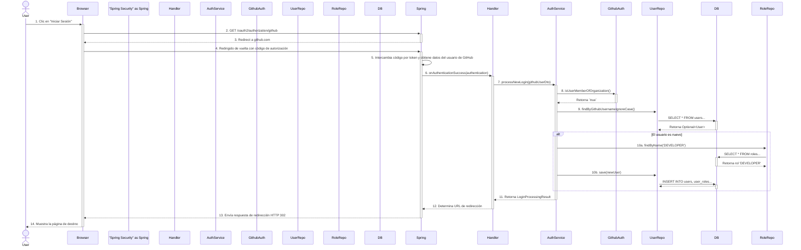
```mermaid
sequenceDiagram
    actor User
    participant Browser
    participant "Spring Security" as Spring
    participant "Oauth2LoginSuccessHandler" as Handler
    participant "AuthenticationService" as AuthService
    participant "GithubUserAuthenticator" as GithubAuth
    participant "UserRepository" as UserRepo
    participant "RoleRepository" as RoleRepo
    participant "Database" as DB

    User->>+Browser: 1. Clic en "Iniciar Sesión"
    Browser->>+Spring: 2. GET /oauth2/authorization/github
    Spring-->>-Browser: 3. Redirect a github.com

    %% Usuario se autentica en GitHub y autoriza %%

    Browser->>+Spring: 4. Redirigido de vuelta con código de autorización
    Spring->>Spring: 5. Intercambia código por token y obtiene datos del usuario de GitHub
    
    Spring->>+Handler: 6. onAuthenticationSuccess(authentication)
    
    Handler->>+AuthService: 7. processNewLogin(githubUserDto)
    
    AuthService->>+GithubAuth: 8. isUserMemberOfOrganization()
    GithubAuth-->>-AuthService: Retorna `true`
    
    AuthService->>+UserRepo: 9. findByGithubUsernameIgnoreCase()
    UserRepo->>+DB: SELECT * FROM users...
    DB-->>-UserRepo: Retorna Optional<User>
    
    alt El usuario es nuevo
        AuthService->>+RoleRepo: 10a. findByName('DEVELOPER')
        
        RoleRepo->>+DB: SELECT * FROM roles...
        DB-->>-RoleRepo: Retorna rol 'DEVELOPER'
        
        AuthService->>+UserRepo: 10b. save(newUser)
        UserRepo->>+DB: INSERT INTO users, user_roles...
        DB-->>-UserRepo: 
    end
    
    AuthService-->>-Handler: 11. Retorna LoginProcessingResult
    
    Handler-->>-Spring: 12. Determina URL de redirección
    
    Spring-->>-Browser: 13. Envía respuesta de redirección HTTP 302
    Browser-->>-User: 14. Muestra la página de destino
```

**Explicación del Flujo:**

1.  **Inicio (1-3):** El usuario inicia el proceso. El navegador es redirigido por Spring Security a GitHub para que el usuario se autentique y autorice la aplicación.
2.  **Callback de GitHub (4-5):** GitHub redirige al usuario de vuelta a la aplicación con un código. Spring Security lo intercepta y lo intercambia por los datos del perfil del usuario de GitHub.
3.  **Handler Personalizado (6):** Una vez que Spring Security confirma la autenticación, cede el control a nuestro `Oauth2LoginSuccessHandler`.
4.  **Procesamiento del Login (7-8):** El handler invoca al `AuthenticationService`, que primero verifica si el usuario pertenece a la organización de GitHub requerida.
5.  **Verificación de Existencia (9):** El servicio consulta la base de datos a través del `UserRepository` para ver si el usuario ya existe en el sistema.
6.  **Flujo de Usuario Nuevo (10a-10b):** Si el usuario no existe, el `AuthenticationService` le asigna un rol por defecto (consultando el `RoleRepository`) y lo guarda en la base de datos.
7.  **Finalización y Redirección (11-14):** El servicio retorna el resultado al handler. El handler determina la página a la que debe ser redirigido el usuario y le indica a Spring Security que envíe la redirección final al navegador.

#### HU-2: Cerrar Sesión

##### Diagrama de Clases
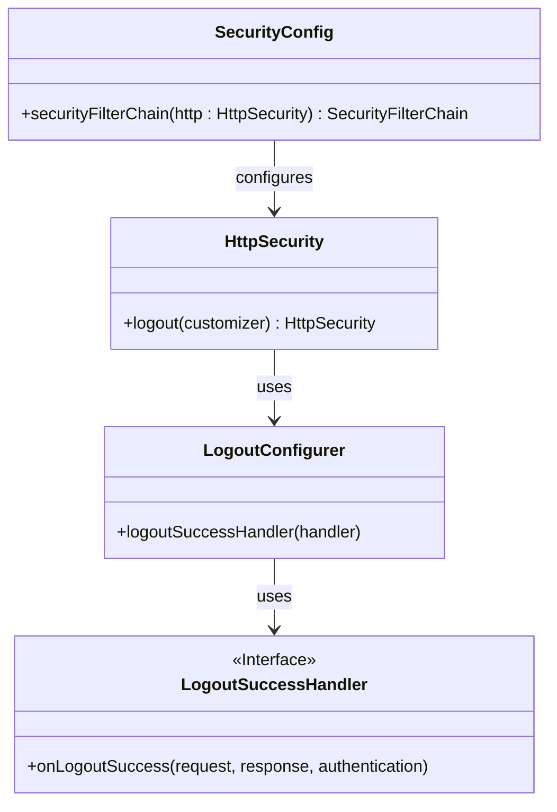
```mermaid
classDiagram
    class SecurityConfig {
        +securityFilterChain(http : HttpSecurity) SecurityFilterChain
    }
    class HttpSecurity {
        +logout(customizer) HttpSecurity
    }
    class LogoutConfigurer {
        +logoutSuccessHandler(handler)
    }
    class LogoutSuccessHandler {
        <<Interface>>
        +onLogoutSuccess(request, response, authentication)
    }

    SecurityConfig --> HttpSecurity : configures
    HttpSecurity --> LogoutConfigurer : uses
    LogoutConfigurer --> LogoutSuccessHandler : uses
```

**Explicación del Diagrama:**

*   **`SecurityConfig`**: Es la clase principal donde se define toda la cadena de filtros de seguridad.
*   **`HttpSecurity`**: Es el objeto constructor que `SecurityConfig` utiliza para definir las reglas. El método `.logout()` inicia la configuración del cierre de sesión.
*   **`LogoutConfigurer`**: Es el objeto devuelto por `.logout()`, que permite personalizar el comportamiento, como especificar un `logoutSuccessHandler`.
*   **`LogoutSuccessHandler`**: Es la interfaz que nuestro manejador personalizado (implementado como una lambda en el código) cumple. Spring Security invoca a este manejador después de invalidar la sesión.

##### Diagrama de Base de Datos (ERD)

No aplica. La operación de cierre de sesión es un proceso de gestión de sesión que no involucra ninguna interacción con la base de datos. El esquema de la base de datos no se ve afectado.

##### Diagrama de Secuencia
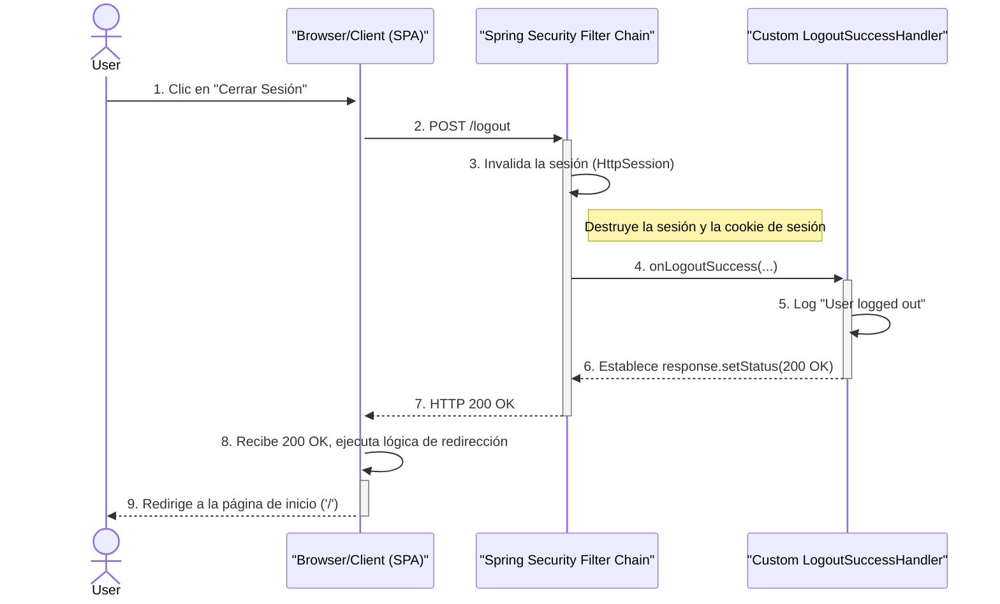
```mermaid
sequenceDiagram
    actor User
    participant Browser/Client as "Browser/Client (SPA)"
    participant SpringSecurity as "Spring Security Filter Chain"
    participant LogoutSuccessHandler as "Custom LogoutSuccessHandler"

    User->>+Browser/Client: 1. Clic en "Cerrar Sesión"

    Browser/Client->>+SpringSecurity: 2. POST /logout

    SpringSecurity->>SpringSecurity: 3. Invalida la sesión (HttpSession)
    note right of SpringSecurity: Destruye la sesión y la cookie de sesión

    SpringSecurity->>+LogoutSuccessHandler: 4. onLogoutSuccess(...)

    LogoutSuccessHandler->>LogoutSuccessHandler: 5. Log "User logged out"
    LogoutSuccessHandler-->>-SpringSecurity: 6. Establece response.setStatus(200 OK)

    SpringSecurity-->>-Browser/Client: 7. HTTP 200 OK

    Browser/Client->>+Browser/Client: 8. Recibe 200 OK, ejecuta lógica de redirección
    Browser/Client-->>-User: 9. Redirige a la página de inicio ('/')
```

**Explicación del Diagrama:**

1.  **Inicio (1-2):** El usuario hace clic en el botón de cerrar sesión en la aplicación de frontend (SPA). El cliente envía una petición `POST` al endpoint `/logout` del backend.
2.  **Procesamiento de Spring Security (3):** La cadena de filtros de Spring Security intercepta la petición. Automáticamente, invalida la sesión HTTP, elimina el contexto de seguridad y borra la cookie de sesión del usuario.
3.  **Manejador Personalizado (4-6):** Una vez que la sesión ha sido destruida, Spring Security invoca nuestro `LogoutSuccessHandler` personalizado. Este manejador no redirige, simplemente ejecuta su lógica (en este caso, registrar un mensaje en el log) y establece el estado de la respuesta HTTP a `200 OK`.
4.  **Respuesta del Backend (7):** El servidor envía la respuesta `200 OK` al cliente, confirmando que el cierre de sesión fue exitoso.
5.  **Redirección del Cliente (8-9):** La aplicación frontend recibe la respuesta `200 OK`. Su código interpreta esta respuesta como una señal de éxito y es **responsable** de redirigir al usuario a la página de inicio de sesión o a la página de bienvenida.

#### HU-3: Configuración Inicial

##### Diagrama de Clases (Corregido con Anotación `<<Interface>>`)
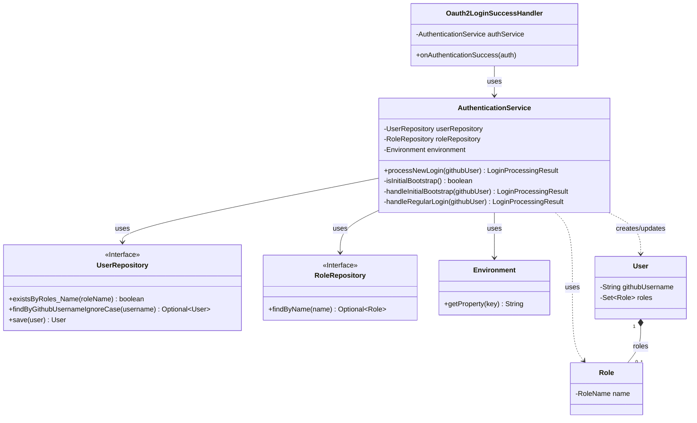
```mermaid
classDiagram
    class Oauth2LoginSuccessHandler {
        -AuthenticationService authService
        +onAuthenticationSuccess(auth)
    }

    class AuthenticationService {
        -UserRepository userRepository
        -RoleRepository roleRepository
        -Environment environment
        +processNewLogin(githubUser) LoginProcessingResult
        -isInitialBootstrap() boolean
        -handleInitialBootstrap(githubUser) LoginProcessingResult
        -handleRegularLogin(githubUser) LoginProcessingResult
    }

    class UserRepository {
        <<Interface>>
        +existsByRoles_Name(roleName) boolean
        +findByGithubUsernameIgnoreCase(username) Optional~User~
        +save(user) User
    }

    class RoleRepository {
        <<Interface>>
        +findByName(name) Optional~Role~
    }
    
    class Environment {
        +getProperty(key) String
    }

    class User {
        -String githubUsername
        -Set~Role~ roles
    }

    class Role {
        -RoleName name
    }

    Oauth2LoginSuccessHandler --> AuthenticationService : uses
    AuthenticationService --> UserRepository : uses
    AuthenticationService --> RoleRepository : uses
    AuthenticationService --> Environment : uses
    AuthenticationService ..> User : creates/updates
    AuthenticationService ..> Role : uses
    User "1" *-- "0..*" Role : roles
```

**Explicación del Diagrama:**

1.  **Punto de Entrada:** El flujo comienza en `Oauth2LoginSuccessHandler` después de una autenticación exitosa en GitHub, que a su vez invoca a `AuthenticationService`.
2.  **Orquestador Central:** `AuthenticationService` es la clase principal. Contiene la lógica para decidir si se trata de un inicio de sesión normal o del "arranque inicial".
3.  **La Decisión Clave:** Para tomar esta decisión, `AuthenticationService` utiliza el `UserRepository` llamando al método `existsByRoles_Name('ADMIN')`. Este método es la pieza central de la HU-3, ya que permite al sistema saber si ya existe un administrador.
4.  **Configuración Externa:** En el caso de ser el arranque inicial, `AuthenticationService` consulta el objeto `Environment` de Spring para obtener el nombre de usuario del administrador designado desde una propiedad de configuración (`dora.initial-admin-username`). Esto desacopla la lógica del nombre de usuario específico.
5.  **Creación de Usuario:** Dependiendo del resultado, se utiliza el `RoleRepository` para obtener el rol `ADMIN` o `DEVELOPER`, y el `UserRepository` para persistir la nueva entidad `User` con su rol correspondiente.

##### Diagrama de Base de Datos (ERD)

```mermaid
erDiagram
    users {
        bigint id PK "Clave Primaria"
        bigint github_id UK "ID único de GitHub"
        varchar github_username UK "Nombre de usuario único de GitHub"
        varchar email "Email del usuario"
    }

    roles {
        bigint id PK "Clave Primaria"
        varchar name UK "Nombre del rol (e.g., ADMIN, DEVELOPER)"
    }

    user_roles {
        bigint user_id PK, FK "Referencia a users.id"
        bigint role_id PK, FK "Referencia a roles.id"
    }

    users ||--o{ user_roles : "tiene"
    roles ||--o{ user_roles : "pertenece a"
```

**Explicación del Diagrama:**

*   **`users`**: Almacena la información de cada usuario. La lógica de la `HU-3` simplemente inserta un nuevo registro aquí.
*   **`roles`**: Tabla maestra que contiene los roles `ADMIN` y `DEVELOPER`.
*   **`user_roles`**: Tabla de unión. Para la `HU-3`, la lógica inserta un registro que vincula al primer usuario con el rol `ADMIN`.

##### Diagrama de Secuencia
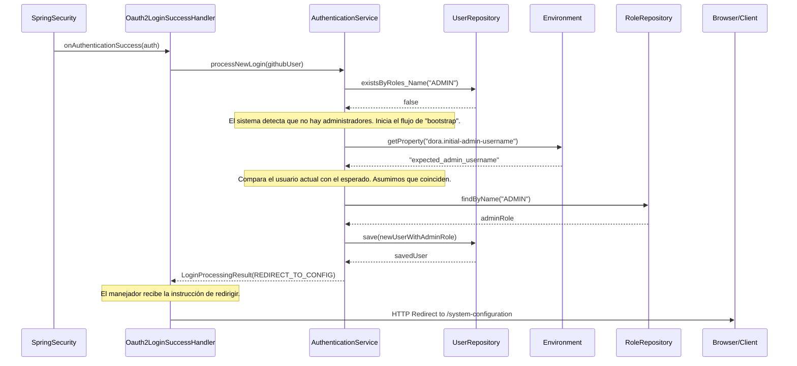
```mermaid
sequenceDiagram
    participant SpringSecurity
    participant Oauth2LoginSuccessHandler
    participant AuthenticationService
    participant UserRepository
    participant Environment
    participant RoleRepository

    SpringSecurity->>Oauth2LoginSuccessHandler: onAuthenticationSuccess(auth)
    Oauth2LoginSuccessHandler->>AuthenticationService: processNewLogin(githubUser)
    
    AuthenticationService->>UserRepository: existsByRoles_Name("ADMIN")
    UserRepository-->>AuthenticationService: false
    
    Note over AuthenticationService: El sistema detecta que no hay administradores. Inicia el flujo de "bootstrap".

    AuthenticationService->>Environment: getProperty("dora.initial-admin-username")
    Environment-->>AuthenticationService: "expected_admin_username"

    Note over AuthenticationService: Compara el usuario actual con el esperado. Asumimos que coinciden.

    AuthenticationService->>RoleRepository: findByName("ADMIN")
    RoleRepository-->>AuthenticationService: adminRole
    
    AuthenticationService->>UserRepository: save(newUserWithAdminRole)
    UserRepository-->>AuthenticationService: savedUser
    
    AuthenticationService-->>Oauth2LoginSuccessHandler: LoginProcessingResult(REDIRECT_TO_CONFIG)
    
    Note over Oauth2LoginSuccessHandler: El manejador recibe la instrucción de redirigir.
    Oauth2LoginSuccessHandler->>Browser/Client: HTTP Redirect to /system-configuration
```

**Explicación del Diagrama:**

1.  **Inicio:** El flujo comienza cuando `SpringSecurity`, tras una autenticación exitosa, invoca a `Oauth2LoginSuccessHandler`.
2.  **Procesamiento:** El `Handler` delega la lógica de negocio a `AuthenticationService`.
3.  **La Decisión Clave:** `AuthenticationService` consulta al `UserRepository` para ver si ya existe algún usuario con el rol `ADMIN`.
4.  **Flujo de "Bootstrap":** Al recibir `false` como respuesta, el servicio entiende que es el primer inicio de sesión.
5.  **Configuración del Admin:** Lee la variable de entorno (`dora.initial-admin-username`) para saber quién debe ser el administrador.
6.  **Creación del Admin:** Asumiendo que el usuario que ha iniciado sesión es el correcto, `AuthenticationService` obtiene el rol `ADMIN` del `RoleRepository` y guarda el nuevo usuario en la base de datos a través del `UserRepository`.
7.  **Redirección:** Finalmente, `AuthenticationService` devuelve un resultado especial (`REDIRECT_TO_CONFIG`) que instruye al `Oauth2LoginSuccessHandler` a redirigir al usuario a la página de configuración del sistema, cumpliendo así con el Criterio de Aceptación 3.2.

#### HU-5: Gestionar Roles

##### Diagrama de Clases
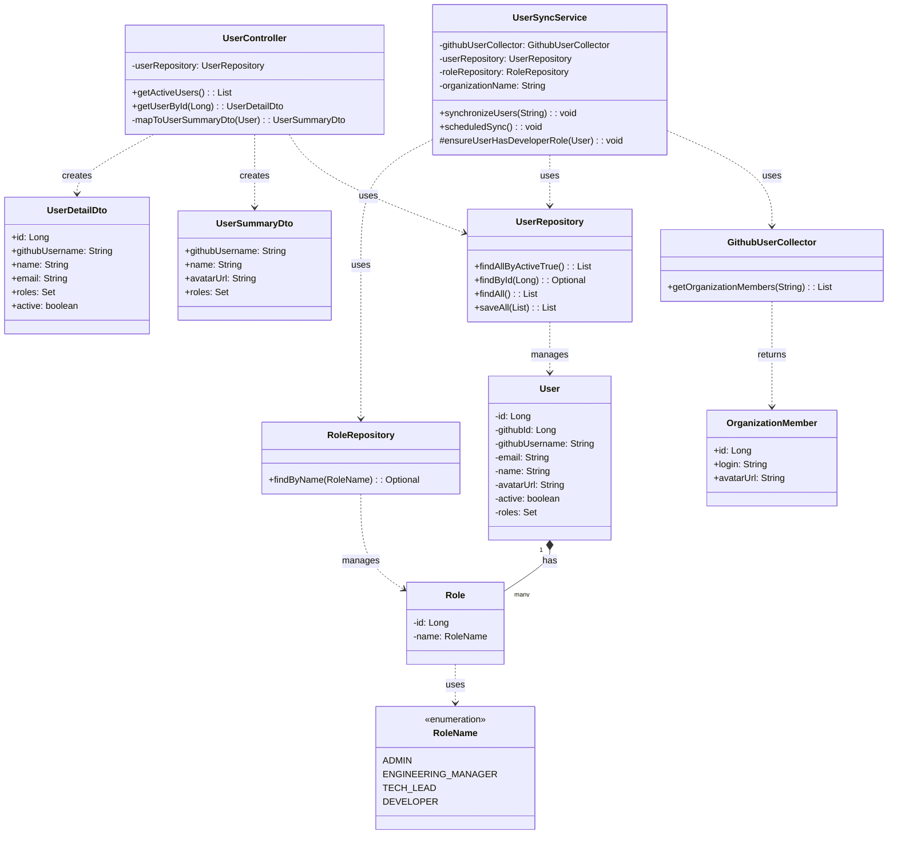
```mermaid
classDiagram
    direction LR

    subgraph module_api
        direction TB
        class UserController {
            -userRepository: UserRepository
            +getActiveUsers(): List<UserSummaryDto>
            +getUserById(Long): UserDetailDto
            -mapToUserSummaryDto(User): UserSummaryDto
        }
        class UserSummaryDto {
            +githubUsername: String
            +name: String
            +avatarUrl: String
            +roles: Set<String>
        }
        class UserDetailDto {
            +id: Long
            +githubUsername: String
            +name: String
            +email: String
            +roles: Set<String>
            +active: boolean
        }
    end

    subgraph module_collector
        direction TB
        class UserSyncService {
            -githubUserCollector: GithubUserCollector
            -userRepository: UserRepository
            -roleRepository: RoleRepository
            -organizationName: String
            +synchronizeUsers(String): void
            +scheduledSync(): void
            #ensureUserHasDeveloperRole(User): void
        }
        class GithubUserCollector {
            +getOrganizationMembers(String): List<OrganizationMember>
        }
        class OrganizationMember {
            +id: Long
            +login: String
            +avatarUrl: String
        }
    end

    subgraph module_domain
        direction TB
        class User {
            -id: Long
            -githubId: Long
            -githubUsername: String
            -email: String
            -name: String
            -avatarUrl: String
            -active: boolean
            -roles: Set<Role>
        }
        class Role {
            -id: Long
            -name: RoleName
        }
        class RoleName {
            <<enumeration>>
            ADMIN
            ENGINEERING_MANAGER
            TECH_LEAD
            DEVELOPER
        }
        class UserRepository {
            +findAllByActiveTrue(): List<User>
            +findById(Long): Optional<User>
            +findAll(): List<User>
            +saveAll(List<User>): List<User>
        }
        class RoleRepository {
            +findByName(RoleName): Optional<Role>
        }
    end

    %% --- Relaciones ---
    UserController ..> UserRepository : uses
    UserController ..> UserSummaryDto : creates
    UserController ..> UserDetailDto : creates

    UserSyncService ..> GithubUserCollector : uses
    UserSyncService ..> UserRepository : uses
    UserSyncService ..> RoleRepository : uses
    GithubUserCollector ..> OrganizationMember : returns

    UserRepository ..> User : manages
    RoleRepository ..> Role : manages
    User "1" *-- "many" Role : has
    Role ..> RoleName : uses
```

##### Notas de Arquitectura

1.  **Flujo de Visualización**: El `UserController` en `module_api` expone endpoints REST para consultar usuarios y sus roles. Utiliza DTOs (`UserSummaryDto` y `UserDetailDto`) para transferir información al frontend, incluyendo los roles asignados a cada usuario mediante una transformación que convierte el `Set<Role>` a `Set<String>` con los nombres de los roles.
2.  **Asignación Automática de Roles**: El `UserSyncService` en `module_collector` sincroniza usuarios desde GitHub y garantiza que todos los usuarios tengan al menos el rol `DEVELOPER` por defecto. El método `ensureUserHasDeveloperRole()` verifica si el usuario ya tiene el rol antes de agregarlo, evitando duplicados y manteniendo la idempotencia de las operaciones.
3.  **Separación de Módulos**: El diagrama evidencia la arquitectura modular:
    *   `module_api`: Maneja la capa de presentación REST con DTOs y documentación OpenAPI.
    *   `module_collector`: Contiene la lógica de sincronización con sistemas externos (GitHub) y asignación automática de roles.
    *   `module_domain`: Define las entidades de negocio, enumeraciones de roles y repositorios de acceso a datos.

##### Diagrama de Base de Datos (ERD)
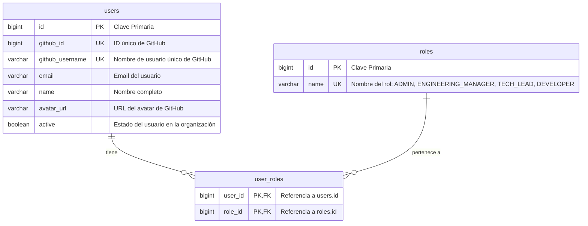
```mermaid
erDiagram
    users {
        bigint id PK "Clave Primaria"
        bigint github_id UK "ID único de GitHub"
        varchar github_username UK "Nombre de usuario único de GitHub"
        varchar email "Email del usuario"
        varchar name "Nombre completo"
        varchar avatar_url "URL del avatar de GitHub"
        boolean active "Estado del usuario en la organización"
    }

    roles {
        bigint id PK "Clave Primaria"
        varchar name UK "Nombre del rol: ADMIN, ENGINEERING_MANAGER, TECH_LEAD, DEVELOPER"
    }

    user_roles {
        bigint user_id PK, FK "Referencia a users.id"
        bigint role_id PK, FK "Referencia a roles.id"
    }

    users ||--o{ user_roles : "tiene"
    roles ||--o{ user_roles : "pertenece a"
```

**Explicación del Diagrama:**

*   **`users`**: Almacena la información completa de cada usuario, incluyendo datos de GitHub y estado de actividad. El campo `active` indica si el usuario sigue siendo miembro de la organización de GitHub.
*   **`roles`**: Tabla maestra que contiene los cuatro roles del sistema: `ADMIN` (administrador con acceso completo), `ENGINEERING_MANAGER` (gestor de ingeniería), `TECH_LEAD` (líder técnico) y `DEVELOPER` (desarrollador, rol por defecto).
*   **`user_roles`**: Tabla de unión que implementa la relación "Muchos a Muchos". La clave primaria compuesta (`user_id`, `role_id`) garantiza que no existan duplicados. Esta estructura permite que un usuario tenga múltiples roles simultáneamente (ej. un usuario puede ser TECH_LEAD y DEVELOPER al mismo tiempo).

##### Diagrama de Secuencia: Listar Usuarios Activos con Roles
```mermaid
sequenceDiagram
    actor Admin
    participant Browser
    participant "UserController" as Controller
    participant "UserRepository" as UserRepo
    participant "Database" as DB

    Admin->>+Browser: 1. Solicita página de gestión de usuarios
    Browser->>+Controller: 2. GET /api/v1/users

    Controller->>+UserRepo: 3. findAllByActiveTrue()
    UserRepo->>+DB: 4. SELECT u.*, r.* FROM users u LEFT JOIN user_roles ur ON u.id = ur.user_id LEFT JOIN roles r ON ur.role_id = r.id WHERE u.active = true
    DB-->>-UserRepo: 5. Retorna List<User> con roles cargados
    UserRepo-->>-Controller: 6. Retorna List<User>

    Controller->>Controller: 7. Transforma cada User a UserSummaryDto extrayendo roles

    Controller-->>-Browser: 8. Retorna JSON con List de UserSummaryDto
    Browser-->>-Admin: 9. Renderiza tabla de usuarios con columna de roles
```

**Explicación del Flujo:**

1.  **Solicitud del Cliente (1-2):** El administrador accede a la página de gestión de usuarios. El frontend realiza una petición GET al endpoint `/api/v1/users`.
2.  **Consulta a Base de Datos (3-6):** El `UserController` utiliza el `UserRepository` para obtener todos los usuarios activos. La consulta SQL realiza un LEFT JOIN con las tablas `user_roles` y `roles` para cargar los roles asociados a cada usuario en una sola consulta, optimizando el rendimiento (evitando el problema N+1).
3.  **Transformación a DTO (7):** El controlador itera sobre cada usuario y extrae los nombres de los roles del `Set<Role>` convirtiéndolos a un `Set<String>` (ej. `["DEVELOPER", "TECH_LEAD"]`). Esto asegura que el frontend solo reciba información necesaria y en formato simple.
4.  **Respuesta al Cliente (8-9):** El controlador retorna una lista JSON de `UserSummaryDto` que incluye el nombre de usuario, nombre completo, avatar y roles. El frontend renderiza esta información en una tabla mostrando los roles de cada usuario.

##### Diagrama de Secuencia: Asignación Automática del Rol DEVELOPER
```mermaid
sequenceDiagram

    Scheduler->>+SyncService: 1. scheduledSync() - Ejecución programada
    SyncService->>+GithubAPI: 2. getOrganizationMembers(organizationName)
    GithubAPI->>GithubAPI: 3. Llama a GitHub API
    GithubAPI-->>-SyncService: 4. Retorna List<OrganizationMember>

    SyncService->>+UserRepo: 5. findAll()
    UserRepo->>+DB: 6. SELECT * FROM users
    DB-->>-UserRepo: 7. Retorna List<User>
    UserRepo-->>-SyncService: 8. Retorna usuarios locales

    loop Para cada miembro de GitHub
        alt Usuario NO existe localmente
            SyncService->>SyncService: 9a. Crea nuevo User con datos de GitHub
            SyncService->>+SyncService: 10a. ensureUserHasDeveloperRole(newUser)

            SyncService->>SyncService: 11a. Verifica: user.getRoles().stream()<br/>.anyMatch(role -> role.getName() == DEVELOPER)

            alt Usuario NO tiene rol DEVELOPER
                SyncService->>+RoleRepo: 12a. findByName(RoleName.DEVELOPER)
                RoleRepo->>+DB: 13a. SELECT * FROM roles WHERE name = 'DEVELOPER'
                DB-->>-RoleRepo: 14a. Retorna Role(DEVELOPER)
                RoleRepo-->>-SyncService: 15a. Retorna Role

                SyncService->>SyncService: 16a. user.getRoles().add(developerRole)
            end

            SyncService-->>-SyncService: 17a. Usuario con rol DEVELOPER garantizado

            Note over SyncService: Agrega newUser a lista de usuarios a guardar
        else Usuario ya existe localmente
            SyncService->>SyncService: 9b. Actualiza datos (avatarUrl, username)
            SyncService->>+SyncService: 10b. ensureUserHasDeveloperRole(existingUser)

            SyncService->>SyncService: 11b. Verifica roles del usuario

            alt Usuario NO tiene rol DEVELOPER
                SyncService->>+RoleRepo: 12b. findByName(RoleName.DEVELOPER)
                RoleRepo->>+DB: 13b. SELECT * FROM roles WHERE name = 'DEVELOPER'
                DB-->>-RoleRepo: 14b. Retorna Role(DEVELOPER)
                RoleRepo-->>-SyncService: 15b. Retorna Role

                SyncService->>SyncService: 16b. user.getRoles().add(developerRole)
            end

            SyncService-->>-SyncService: 17b. Usuario actualizado con rol DEVELOPER

            Note over SyncService: Agrega existingUser a lista de usuarios a guardar
        end
    end

    SyncService->>+UserRepo: 18. saveAll(usersToSave)
    UserRepo->>+DB: 19. INSERT/UPDATE en users y user_roles
    DB-->>-UserRepo: 20. Confirma transacción
    UserRepo-->>-SyncService: 21. Retorna usuarios guardados

    SyncService-->>-Scheduler: 22. Sincronización completada
```

**Explicación del Flujo:**

1.  **Ejecución Programada (1):** El scheduler de Spring ejecuta `scheduledSync()` periódicamente según la configuración `@Scheduled`.
2.  **Obtención de Miembros de GitHub (2-4):** El `UserSyncService` consulta la API de GitHub a través del `GithubUserCollector` para obtener la lista actualizada de miembros de la organización.
3.  **Obtención de Usuarios Locales (5-8):** El servicio consulta todos los usuarios existentes en la base de datos para compararlos con los miembros de GitHub.
4.  **Procesamiento de Cada Miembro (9-17):**
    *   **Nuevo Usuario (9a-17a):** Si el miembro de GitHub no existe localmente, se crea un nuevo objeto `User`. Se invoca `ensureUserHasDeveloperRole()` que verifica mediante `anyMatch()` si el usuario tiene el rol DEVELOPER. Si no lo tiene, consulta el `RoleRepository` para obtener el rol DEVELOPER y lo agrega al `Set<Role>` del usuario.
    *   **Usuario Existente (9b-17b):** Si el usuario ya existe, se actualizan sus datos (avatar, username). Se ejecuta el mismo proceso de `ensureUserHasDeveloperRole()` para garantizar que tenga el rol DEVELOPER. Si el usuario ya tiene otros roles (ej. TECH_LEAD), el rol DEVELOPER se agrega sin eliminar los roles existentes.
5.  **Persistencia en Lote (18-21):** El servicio guarda todos los usuarios procesados en una sola operación `saveAll()`, optimizando las transacciones de base de datos. Se insertan o actualizan registros en las tablas `users` y `user_roles`.
6.  **Finalización (22):** La sincronización se completa exitosamente, garantizando que todos los usuarios de la organización de GitHub estén sincronizados con roles correctos en el sistema.

**Características Clave de la Implementación:**

*   **Idempotencia:** La verificación con `anyMatch()` antes de agregar el rol asegura que no se creen duplicados, permitiendo ejecutar la sincronización múltiples veces sin efectos secundarios.
*   **Preservación de Roles Existentes:** El método `ensureUserHasDeveloperRole()` solo agrega el rol DEVELOPER si falta, sin modificar otros roles que el usuario pueda tener (ADMIN, TECH_LEAD, etc.).
*   **Operaciones en Lote:** El uso de `saveAll()` reduce el número de transacciones a la base de datos, mejorando el rendimiento en sincronizaciones con muchos usuarios.

#### HU-10: Recolectar Datos de GitHub

##### Diagrama de Clases
```mermaid
classDiagram
    direction LR

    class TesisBachillerBackendMultimodularApplication {
        <<Application>>
        +main()
    }

    namespace Scheduler {
        class PullRequestSyncService {
            <<Service>>
            +syncPullRequests() @Scheduled
        }
        class CommitSyncService {
            <<Service>>
            +syncCommits() @Scheduled
        }
    }

    namespace CollectorModule {
        class GithubPullRequestCollector {
            <<Interface>>
            +getPullRequests(owner, repo, since)
        }
        class GithubCommitCollector {
            <<Interface>>
            +getCommits(owner, repo, since)
        }
        class GithubClientImpl {
            <<Component>>
            +getPullRequests(owner, repo, since)
            +getCommits(owner, repo, since)
        }
    }

    namespace DomainPersistence {
        class PullRequestRepository {
            <<Repository>>
            +findAll()
            +saveAll(entities)
        }
        class CommitRepository {
            <<Repository>>
            +existsById(sha)
            +saveAll(entities)
        }
        class CommitParentRepository {
            <<Repository>>
            +existsByCommitShaAndParentSha(childSha, parentSha)
            +saveAll(entities)
        }
    }

    %% --- Relaciones entre clases ---
    
    %% El scheduling se activa a nivel de aplicación
    TesisBachillerBackendMultimodularApplication --|> PullRequestSyncService : triggers
    TesisBachillerBackendMultimodularApplication --|> CommitSyncService : triggers

    %% Relaciones desde los servicios de Sincronización
    PullRequestSyncService --|> GithubPullRequestCollector : uses
    CommitSyncService --|> GithubCommitCollector : uses
    PullRequestSyncService --|> PullRequestRepository : uses
    CommitSyncService --|> CommitRepository : uses
    CommitSyncService --|> CommitParentRepository : uses

    %% Relaciones dentro del módulo Collector
    GithubClientImpl ..|> GithubPullRequestCollector : implements
    GithubClientImpl ..|> GithubCommitCollector : implements
```

**Explicación del Diagrama:**

*   **Punto de Entrada (`Scheduler`):** La aplicación principal habilita la programación de tareas. Los servicios `PullRequestSyncService` y `CommitSyncService` contienen métodos anotados con `@Scheduled` que actúan como los puntos de entrada del proceso.
*   **Módulo de Colección (`CollectorModule`):** Los servicios de sincronización dependen de interfaces (`GithubPullRequestCollector`, `GithubCommitCollector`) para obtener los datos. Esto es un buen diseño que sigue el Principio de Inversión de Dependencias. La clase `GithubClientImpl` es la implementación concreta que se comunica con la API de GitHub.
*   **Dominio y Persistencia (`DomainPersistence`):** Una vez que los datos son recolectados, los servicios utilizan los repositorios de Spring Data JPA (`PullRequestRepository`, `CommitRepository`, etc.) para guardar las entidades en la base de datos, asegurando la idempotencia al verificar si los datos ya existen.

##### Diagrama de Base de Datos (ERD)
```mermaid
erDiagram
    REPOSITORY_CONFIG {
        bigint id PK
        varchar owner "Dueño del repositorio (org/usuario)"
        varchar name "Nombre del repositorio"
    }

    SYNC_STATUS {
        varchar job_name PK "Nombre único del job (ej. COMMIT_SYNC)"
        datetime last_successful_run "Timestamp de la última ejecución exitosa"
    }

    PULL_REQUESTS {
        bigint id PK "ID numérico de GitHub"
        bigint repository_id FK "Referencia a REPOSITORY_CONFIG"
        varchar state "Estado (open, closed, merged)"
        datetime created_at
        datetime merged_at
        varchar merge_commit_sha "SHA del commit de merge"
    }

    COMMITS {
        varchar sha PK "SHA del commit"
        bigint repository_id FK "Referencia a REPOSITORY_CONFIG"
        datetime author_date "Timestamp del autor"
        varchar message "Mensaje del commit"
    }

    COMMIT_PARENTS {
        varchar commit_sha PK, FK "SHA del commit hijo"
        varchar parent_sha PK, FK "SHA del commit padre"
    }

    REPOSITORY_CONFIG ||--|{ PULL_REQUESTS : "tiene"
    REPOSITORY_CONFIG ||--|{ COMMITS : "tiene"
    COMMITS |o--o{ COMMIT_PARENTS : "es hijo de"
    COMMITS |o--o{ COMMIT_PARENTS : "es padre de"
```

**Explicación del Diagrama:**

*   **`REPOSITORY_CONFIG`**: Almacena la configuración de los repositorios de GitHub que el sistema debe monitorear. Es el punto de partida para los jobs de sincronización.
*   **`SYNC_STATUS`**: Tabla de metadatos crucial para la sincronización incremental. Cada `job_name` (ej. `COMMIT_SYNC`, `PULL_REQUEST_SYNC`) tiene un registro que guarda la fecha y hora de la última ejecución exitosa (`last_successful_run`).
*   **`PULL_REQUESTS`**: Almacena los datos de los Pull Requests recolectados. El `id` es el identificador numérico de GitHub, lo que facilita la prevención de duplicados.
*   **`COMMITS`**: Almacena los datos de los commits. La clave primaria es el `sha` del commit, que es único por naturaleza.
*   **`COMMIT_PARENTS`**: Esta es una tabla de unión que resuelve la relación de grafo "Muchos a Muchos" que tienen los commits entre sí. Un commit puede tener múltiples padres (en el caso de un merge commit) y un commit puede ser el padre de múltiples hijos. Cada fila vincula un `commit_sha` (el hijo) con un `parent_sha` (el padre). Esta tabla es fundamental para poder reconstruir el historial de cambios y calcular métricas como el Lead Time.

##### Diagrama de Secuencia
```mermaid
sequenceDiagram
    participant Scheduler as "Spring Scheduler"
    participant SyncService as "PullRequestSyncService / CommitSyncService"
    participant SyncStatusRepo as "SyncStatusRepository"
    participant RepoConfigRepo as "RepositoryConfigRepository"
    participant Collector as "Github*Collector"
    participant GitHubApi as "GitHub API"
    participant DomainRepo as "PullRequestRepository / CommitRepository"
    participant DB as "Database"

    Scheduler->>+SyncService: 1. execute() @Scheduled
    
    SyncService->>+RepoConfigRepo: 2. findAll()
    RepoConfigRepo-->>-SyncService: 3. List<RepositoryConfig>

    loop para cada RepositoryConfig
        SyncService->>+SyncStatusRepo: 4. findById(jobName)
        SyncStatusRepo-->>-SyncService: 5. Optional<SyncStatus> (con last_successful_run)

        SyncService->>+Collector: 6. getPullRequests/getCommits(repo, since)
        Collector->>+GitHubApi: 7. GET /repos/{owner}/{repo}/pulls?since=...
        GitHubApi-->>-Collector: 8. Lista de DTOs de GitHub
        Collector-->>-SyncService: 9. Lista de DTOs

        SyncService->>+DomainRepo: 10. findByIds(ids_from_dtos)
        DomainRepo-->>-SyncService: 11. Lista de entidades existentes

        note over SyncService: Compara DTOs con entidades existentes para encontrar solo los nuevos.

        SyncService->>+DomainRepo: 12. saveAll(nuevas_entidades)
        DomainRepo->>+DB: INSERT INTO ...
        DB-->>-DomainRepo: 
        DomainRepo-->>-SyncService: 

        SyncService->>+SyncStatusRepo: 13. save(updatedSyncStatus)
        SyncStatusRepo->>+DB: UPDATE sync_status SET ...
        DB-->>-SyncStatusRepo: 
        SyncStatusRepo-->>-SyncService: 
    end
```

**Explicación del Diagrama:**

1.  **Disparo Programado (1):** El `Scheduler` de Spring invoca automáticamente el método anotado con `@Scheduled` en el servicio de sincronización (ej. `PullRequestSyncService`).
2.  **Obtener Repositorios (2-3):** El servicio consulta la base de datos para obtener la lista de todos los repositorios que deben ser monitoreados.
3.  **Sincronización Incremental (4-5):** Por cada repositorio, el servicio consulta la tabla `SyncStatus` para obtener la fecha y hora de la última ejecución exitosa. Esta fecha se usará para pedir a GitHub solo los datos nuevos.
4.  **Recolección de Datos (6-9):** El servicio delega la comunicación a un `Collector`, que a su vez llama a la API de GitHub, pasando el parámetro `since` para una carga eficiente. La API devuelve una lista de DTOs (Data Transfer Objects).
5.  **Idempotencia (10-11):** Antes de guardar, el servicio consulta su propia base de datos (`DomainRepo`) para ver cuáles de los datos recibidos ya existen.
6.  **Persistencia (12):** El servicio transforma los DTOs nuevos en entidades de dominio y los guarda en la base de datos.
7.  **Actualización de Estado (13):** Finalmente, el servicio actualiza la tabla `SyncStatus` con la fecha y hora actuales, marcando el punto de partida para la próxima ejecución.


### HU-11: Procesar Métricas de Velocidad
### HU-11.1: Frecuencia de Despliegues

*   **Definición:** Mide la frecuencia con la que el software se despliega exitosamente en un entorno específico. Esta es una de las cuatro métricas DORA clave y mide la cadencia de entrega del equipo. A diferencia de la HU-11.2, este cálculo se realiza bajo demanda a través de un servicio y no se persiste en una tabla propia.
*   **AC 11.1.1:** Dado que existen despliegues en un entorno, cuando el servicio es invocado con un rango de fechas y un período, el sistema debe contar cuántos despliegues ocurrieron en cada sub-período (semanal, mensual, etc.).
*   **AC 11.1.2:** El resultado del conteo para cada sub-período debe retornarse como una lista de objetos `DeploymentFrequency`.

#### Diagrama de Clases

El siguiente diagrama muestra las clases principales involucradas. `DeploymentFrequencyService` orquesta el cálculo, utilizando `DeploymentRepository` para obtener los datos crudos de los despliegues. `DeploymentFrequency` actúa como un objeto de transferencia de datos (DTO) para devolver los resultados calculados.

```mermaid
classDiagram
    direction LR

    class DeploymentFrequencyService {
        <<Service>>
        +DeploymentRepository deploymentRepository
        +calculate(String, LocalDate, LocalDate, PeriodType): List<~DeploymentFrequency~>
    }

    class DeploymentRepository {
        <<Repository>>
        +findByEnvironmentAndCreatedAtBetween(...): List<~Deployment~>
    }

    class DeploymentFrequency {
        <<DTO>>
        -periodStart: LocalDate
        -periodEnd: LocalDate
        -count: int
        +DeploymentFrequency(LocalDate, LocalDate, int)
    }

    class PeriodType {
        <<enumeration>>
        MONTHLY
        WEEKLY
        BIWEEKLY
    }

    class Deployment {
        <<Entity>>
        +createdAt: LocalDateTime
        +environment: String
    }

    DeploymentFrequencyService --|> DeploymentRepository : uses
    DeploymentFrequencyService ..> DeploymentFrequency : creates
    DeploymentFrequencyService ..> PeriodType : uses
    DeploymentRepository ..> Deployment : returns
```

#### Diagrama de Entidad-Relación

El análisis del código revela que esta funcionalidad **no introduce una nueva tabla** en la base de datos. El cálculo se realiza en tiempo de ejecución consultando la tabla `DEPLOYMENT` existente. Por lo tanto, el único diagrama relevante es el de la tabla que sirve como fuente de datos.

```mermaid
erDiagram
    DEPLOYMENT {
        bigint id PK
        varchar sha
        varchar environment
        timestamp created_at
        boolean processed
    }
```
*   **Nota:** El servicio utiliza los campos `environment` y `created_at` para filtrar y contar los despliegues.

#### Diagrama de Secuencia

El diagrama de secuencia ilustra cómo un cliente (por ejemplo, un `Controller` de la API) invoca el servicio para obtener la métrica. El servicio, a su vez, consulta el repositorio de despliegues y procesa los datos para construir la respuesta.

```mermaid
sequenceDiagram
    participant Client as "API Client / Controller"
    participant Service as "DeploymentFrequencyService"
    participant DepRepo as "DeploymentRepository"
    participant DB as "Database"

    Client->>+Service: 1. calculate("prod", "2023-01-01", "2023-03-31", "MONTHLY")

    loop para cada período (ej. mensual)
        Service->>+DepRepo: 2. findByEnvironmentAndCreatedAtBetween("prod", periodStart, periodEnd)
        DepRepo->>+DB: SELECT * FROM deployment WHERE...
        DB-->>DepRepo: "Lista de Deployments"
        DepRepo-->>Service: "List<Deployment>"

        note over Service: Calcula el tamaño de la lista (count)

        Service->>Service: 3. new DeploymentFrequency(periodStart, periodEnd, count)
    end

    Service-->>-Client: "4. List<DeploymentFrequency>"
```

#### HU-11.2: Lead Time for Changes (Métrica DORA)
*   **Definición:** Mide el tiempo desde que se escribe un commit hasta que ese commit es desplegado en producción. Esta es una de las cuatro métricas DORA clave y mide la velocidad de entrega de valor.
*   **AC 11.2.1:** Dado que existen despliegues a producción no procesados, cuando el job de cálculo se ejecuta, entonces el sistema debe identificar los commits nuevos introducidos en cada despliegue.
*   **AC 11.2.2:** Para cada commit nuevo, el sistema debe calcular el tiempo transcurrido desde la fecha del commit hasta la fecha del despliegue.
*   **AC 11.2.3:** El resultado de cada cálculo (Lead Time por commit) debe guardarse en la tabla `CHANGE_LEAD_TIME`.
*   **AC 11.2.4:** El despliegue procesado debe marcarse como tal (`lead_time_processed = true`) para garantizar la idempotencia.

##### Diagrama de Clases
```mermaid
classDiagram
direction LR

namespace Scheduler {
    class LeadTimeCalculationService {
        <<Service>>
        +calculateLeadTime() @Scheduled
    }
}

namespace DomainPersistence {
    class DeploymentRepository {
        <<Repository>>
        +findNotProcessedInProduction()
        +findLastProcessedInProduction()
    }
    class CommitRepository {
        <<Repository>>
        +findCommitsInBranch()
    }
    class ChangeLeadTimeRepository {
        <<Repository>>
        +saveAll(entities)
    }
}

namespace DomainModel {
    class Deployment {
        +sha: String
        +environment: String
        +createdAt: LocalDateTime
        +leadTimeProcessed: boolean
    }
    class Commit {
        +sha: String
        +date: LocalDateTime
    }
    class ChangeLeadTime {
        +leadTimeInSeconds: long
    }
}

%% --- Relaciones ---
LeadTimeCalculationService --|> DeploymentRepository : uses
LeadTimeCalculationService --|> CommitRepository : uses
LeadTimeCalculationService --|> ChangeLeadTimeRepository : uses

ChangeLeadTime --o Deployment : calculated_for
ChangeLeadTime --o Commit : measures
```

**Explicación del Diagrama:**

*   **Scheduler:** El `LeadTimeCalculationService` contiene un método programado (`@Scheduled`) que inicia el proceso de cálculo periódicamente.
*   **DomainPersistence (Repositorios):** El servicio depende de varios repositorios para interactuar con la base de datos:
*   `DeploymentRepository` para encontrar los despliegues en producción que necesitan ser procesados.
*   `CommitRepository` para navegar el grafo de commits.
*   `ChangeLeadTimeRepository` para guardar los resultados del cálculo.
*   **DomainModel (Entidades):** Muestra las entidades clave involucradas: `Deployment` (el disparador), `Commit` (lo que se mide) y `ChangeLeadTime` (el resultado).
*   **Relaciones:** Las flechas indican las dependencias y el flujo de control, desde el servicio hacia los repositorios y las entidades que manipula.

##### Diagrama de Base de Datos (ERD)
```mermaid
erDiagram
DEPLOYMENT {
    bigint id PK
    varchar sha FK "Ref al commit desplegado"
    varchar environment "Ej: production"
    datetime created_at "Timestamp del despliegue"
    boolean lead_time_processed "Flag de idempotencia"
}

COMMIT {
    varchar sha PK
    datetime author_date
    varchar message
}

CHANGE_LEAD_TIME {
    bigint id PK
    varchar commit_sha FK "Ref al commit medido"
    bigint deployment_id FK "Ref al despliegue que lo incluyó"
    bigint lead_time_in_seconds "Métrica calculada"
}

DEPLOYMENT ||--|{ COMMIT : "despliega"
CHANGE_LEAD_TIME }o--|| COMMIT : "mide"
CHANGE_LEAD_TIME }o--|| DEPLOYMENT : "es calculado para"
```

**Explicación del Diagrama:**

*   **`DEPLOYMENT`**: Almacena los registros de cada despliegue. El campo `sha` lo vincula al commit exacto que se desplegó. El flag `lead_time_processed` es crucial para que el job de cálculo no procese el mismo despliegue más de una vez.
*   **`COMMIT`**: La tabla de commits que ya recolectamos con la HU-10.
*   **`CHANGE_LEAD_TIME`**: Esta es la tabla de resultados. Cada fila es un hecho que dice: "El commit *X* tuvo un Lead Time de *Y* segundos, medido en el momento del despliegue *Z*".
*   **Relaciones:**
*   Un `COMMIT` puede estar en muchos `DEPLOYMENT`s (si se despliega varias veces).
*   Un `COMMIT` puede tener un registro de `CHANGE_LEAD_TIME`.
*   Un `DEPLOYMENT` puede resultar en el cálculo de muchos `CHANGE_LEAD_TIME`s (uno por cada nuevo commit en ese despliegue).

##### Diagrama de Secuencia
```mermaid
sequenceDiagram
    participant Scheduler as "Spring Scheduler"
    participant Service as "LeadTimeCalculationService"
    participant DepRepo as "DeploymentRepository"
    participant CommitRepo as "CommitRepository"
    participant CLTRepo as "ChangeLeadTimeRepository"
    participant DB as "Database"

    Scheduler->>+Service: 1. calculateLeadTime() @Scheduled

    Service->>+DepRepo: 2. findNotProcessedInProduction()
    DepRepo-->>Service: "3. List<Deployment> (deployments_a_procesar)"

    loop para cada Deployment actual
        Service->>+DepRepo: 4. findLastProcessedInProduction(actual.createdAt)
        DepRepo-->>Service: "5. Optional<Deployment> (deploy_anterior)"

        note over Service: El SHA del deploy_anterior es el límite para el grafo.

        Service->>+CommitRepo: 6. findCommitsBetween(actual.sha, anterior.sha)
        CommitRepo-->>Service: "7. List<Commit> (nuevos_commits)"

        note over Service: Calcula el Lead Time para cada nuevo_commit.
        Service->>Service: 8. (actual.createdAt - commit.date)

        Service->>+CLTRepo: 9. saveAll(lista_de_ChangeLeadTime)
        CLTRepo->>+DB: INSERT INTO change_lead_time...
        DB-->>CLTRepo: "ok"

        CLTRepo-->>Service: "ok"

        note over Service: Marca el deployment actual como procesado.

        Service->>+DepRepo: 10. save(actual_deployment.setProcessed(true))
        DepRepo->>+DB: UPDATE deployment SET...
        DB-->>DepRepo: "ok"
        DepRepo-->>Service: "ok"

    end

    deactivate Service
```

**Explicación del Diagrama:**

1.  **Disparo Programado (1):** El `Scheduler` de Spring invoca el método de cálculo en el `LeadTimeCalculationService`.
2.  **Buscar Trabajo (2-3):** El servicio consulta al `DeploymentRepository` por despliegues en producción que aún no han sido procesados (el flag `lead_time_processed` está en `false`).
3.  **Establecer Límite (4-5):** Por cada despliegue a procesar, el servicio busca el despliegue anterior en producción. El commit de este despliegue anterior servirá como el punto de parada (límite) en el recorrido del historial.
4.  **Identificar Commits Nuevos (6-7):** El servicio pide al `CommitRepository` que le entregue todos los commits que ocurrieron entre el commit del despliegue actual y el commit del despliegue anterior. Esto aísla efectivamente los cambios nuevos.
5.  **Calcular Métrica (8):** El servicio itera sobre la lista de commits nuevos y, para cada uno, calcula la diferencia entre la fecha de despliegue y la fecha del commit.
6.  **Guardar Resultados (9):** El servicio crea una lista de entidades `ChangeLeadTime` y las persiste en la base de datos a través de su repositorio.
7.  **Marcar como Procesado (10):** Finalmente, el servicio actualiza el flag `lead_time_processed` en la entidad `Deployment` y la guarda. Este paso es crucial para garantizar la idempotencia y evitar que el trabajo se repita en la siguiente ejecución.

#### HU-17: Implementar un Modelo de Acceso "Cerrado por Defecto" en el Arranque

##### Diagrama de Clases
```mermaid
classDiagram
    class SecurityConfig {
        -authenticationService: AuthenticationService
        +securityFilterChain(http: HttpSecurity): SecurityFilterChain
    }
    class AuthenticationService {
        +isInitialBootstrap(): boolean
    }
    class HttpSecurity {
        +authorizeHttpRequests(customizer): HttpSecurity
    }

    SecurityConfig --|> AuthenticationService : uses
    SecurityConfig --|> HttpSecurity : configures
```

**Explicación del Diagrama:**

*   **`SecurityConfig`**: La clase de configuración de seguridad ahora tiene una dependencia (`uses`) de `AuthenticationService`.
*   **`AuthenticationService`**: Expone un método público `isInitialBootstrap()` que `SecurityConfig` puede invocar.
*   **`HttpSecurity`**: El objeto constructor que `SecurityConfig` utiliza para aplicar las reglas de autorización que se deciden dinámicamente.

##### Diagrama de Base de Datos (ERD)

No aplica. Esta funcionalidad es una lógica de configuración de seguridad que se aplica en tiempo de ejecución. No interactúa directamente con la base de datos ni modifica su esquema. Las decisiones de autorización se basan en el estado del sistema (si existe un administrador o no), pero la lógica en sí misma no realiza operaciones CRUD sobre las tablas.

##### Diagrama de Secuencia
```mermaid
sequenceDiagram
    actor User
    participant Browser
    participant SpringSecurity as "Spring Security Filter Chain"
    participant SecurityConfig as "SecurityConfig Bean"
    participant AuthenticationService as "AuthenticationService"
    participant UserRepository as "UserRepository"

    User->>+Browser: 1. Accede a /api/protected-endpoint
    Browser->>+SpringSecurity: 2. GET /api/protected-endpoint

    Note over SpringSecurity: La petición es interceptada por la cadena de filtros.

    SpringSecurity->>+SecurityConfig: 3. Aplica reglas de `securityFilterChain`

    SecurityConfig->>+AuthenticationService: 4. Llama a `isInitialBootstrap()`
    
    AuthenticationService->>+UserRepository: 5. Llama a `existsByRoles_Name("ADMIN")`
    UserRepository-->>-AuthenticationService: 6. Retorna `false`
    
    AuthenticationService-->>-SecurityConfig: 7. Retorna `true`

    Note over SecurityConfig: `isInitialBootstrap()` es verdadero. Se aplican las reglas de "cerrado por defecto".

    SecurityConfig-->>-SpringSecurity: 8. Configura `denyAll()` para la petición

    SpringSecurity-->>-Browser: 9. HTTP 403 Forbidden
    Browser-->>-User: 10. Muestra página de Acceso Denegado
```

**Explicación del Diagrama:**

1.  **Petición (1-2):** Un usuario (que podría estar o no autenticado) intenta acceder a un endpoint protegido de la API.
2.  **Intercepción (3):** La cadena de filtros de Spring Security intercepta la petición antes de que llegue al controlador.
3.  **Decisión Dinámica (4-7):** La configuración de seguridad (`SecurityConfig`) no aplica una regla estática. En su lugar, invoca al `AuthenticationService` para consultar el estado del sistema. El `AuthenticationService` a su vez consulta la base de datos a través del `UserRepository` para verificar si existe algún administrador. Como no existe, `isInitialBootstrap()` devuelve `true`.
4.  **Aplicación de la Regla (8):** Al recibir `true`, `SecurityConfig` aplica la regla más estricta posible para la petición entrante: `denyAll()`. Esta regla bloquea el acceso incondicionalmente.
5.  **Respuesta de Acceso Denegado (9-10):** Spring Security, siguiendo la regla `denyAll()`, detiene el procesamiento de la petición y devuelve inmediatamente una respuesta `HTTP 403 Forbidden` al navegador, impidiendo cualquier acceso a la lógica de negocio del endpoint.

#### Diagrama de Secuencia: `module-collector` (GitHub)
```mermaid
sequenceDiagram
    participant Job as Scheduled Job
    participant Collector as CollectorService
    participant GitHub as GitHub API
    participant DB as Database

    activate Job
    Job->>Collector: Iniciar recolección de eventos
    activate Collector
    
    Collector->>GitHub: GET /repos/.../events?since=...
    GitHub-->>Collector: Lista de eventos JSON
    
    loop por cada evento
        Collector->>DB: INSERT INTO Raw_Events (...)
        alt Evento ya existe
            DB-->>Collector: UniqueConstraintViolation
            note over Collector: Ignorar duplicado
        else Evento nuevo
            DB-->>Collector: OK
        end
    end

    deactivate Collector
    deactivate Job
```

---

## Apéndice B: Estrategia de Integración y Despliegue Continuo (CI/CD)

La estrategia de CI/CD se implementará utilizando **GitHub Actions**. La documentación detallada y los scripts de los workflows se mantendrán directamente en el repositorio de código, siguiendo el principio de "Docs as Code".

### B.1: Estrategia de Alto Nivel

El pipeline de CI/CD se diseñará para automatizar el proceso de construcción, prueba y despliegue de la aplicación.

* **Disparadores (Triggers):**
    * El workflow principal se ejecutará automáticamente en cada `push` a la rama `main`.
    * También se ejecutará en la creación de `Pull Requests` que apunten a `main`, para validar los cambios antes de que se integren.

* **Etapas Principales (Jobs):**
    1.  **Build & Test:**
        * Se compilará el backend de Spring Boot utilizando Gradle.
        * Se ejecutarán todas las pruebas unitarias y de integración, incluyendo las pruebas de verificación de la arquitectura de Spring Modulith.
    2.  **Build Docker Image:**
        * Si la etapa anterior es exitosa, se construirá la imagen de Docker de la aplicación.
        * La imagen se etiquetará con el SHA del commit y se subirá a un registro de contenedores (ej. GitHub Container Registry).
    3.  **Deploy:**
        * Esta etapa se ejecutará solo en los `push` a `main`.
        * Utilizará Terraform para provisionar o actualizar la infraestructura en la nube.
        * Desplegará la nueva versión de la imagen de Docker en el entorno de producción.

### B.2: Documentación Detallada

La implementación específica y los scripts de los workflows de GitHub Actions se encuentran documentados en el siguiente archivo dentro del repositorio del proyecto:

* `[Enlace al README.md en .github/workflows/ en tu repositorio]`

---

## 13. Arquitectura de Infraestructura en AWS

La infraestructura de la aplicación se gestiona completamente como código utilizando Terraform, garantizando la reproducibilidad, el control de versiones y la automatización. La arquitectura está diseñada para ser segura, escalable y para operar dentro de la capa gratuita de AWS.

### 13.1. Diagrama de Arquitectura

```mermaid
graph TD
    subgraph "Internet"
        User[<i class='fa fa-user'></i> Usuario]
    end

    subgraph "AWS Cloud (us-east-2)"
        subgraph "VPC (tesis-vpc)"
            IGW[<i class='fa fa-cloud'></i> Internet Gateway]
            RT[<i class='fa fa-route'></i> Tabla de Rutas Pública]

            subgraph "Zona de Disponibilidad: us-east-2a"
                subgraph "Subred Pública A"
                    ALB_A[ALB]
                    EC2_A[<i class='fa fa-desktop'></i> EC2 / Docker]
                end
                subgraph "Subred Privada A"
                    RDS_A["<i class='fa fa-database'></i> RDS MySQL <br> (Standby)"]
                end
            end

            subgraph "Zona de Disponibilidad: us-east-2b"
                subgraph "Subred Pública B"
                    ALB_B[ALB]
                    EC2_B[<i class='fa fa-desktop'></i> EC2 / Docker]
                end
                subgraph "Subred Privada B"
                    RDS_B["<i class='fa fa-database'></i> RDS MySQL <br> (Principal)"]
                end
            end

            subgraph "Firewalls (Security Groups)"
                style Firewalls fill:#f9f,stroke:#333,stroke-width:2px,opacity:0.5
                App_SG[App SG]
                DB_SG[DB SG]
            end
        end
    end

    %% Flujo de Conexiones
    User -- HTTPS --> ALB_A
    User -- HTTPS --> ALB_B
    ALB_A --> EC2_A
    ALB_B --> EC2_B
    EC2_A -- TCP 3306 --> RDS_B
    EC2_B -- TCP 3306 --> RDS_B

    %% Conexiones de Red
    User <--> IGW
    IGW <--> RT
    RT --> ALB_A
    RT --> ALB_B

    %% Asociaciones de Security Groups
    ALB_A -.- App_SG
    ALB_B -.- App_SG
    EC2_A --- App_SG
    EC2_B --- App_SG
    RDS_A --- DB_SG
    RDS_B --- DB_SG
    App_SG -- Permite TCP 3306 --> DB_SG

    %% Estilos
    linkStyle 0 stroke-width:2px,fill:none,stroke:blue;
    linkStyle 1 stroke-width:2px,fill:none,stroke:blue;
    linkStyle 2 stroke-width:2px,fill:none,stroke:green;
    linkStyle 3 stroke-width:2px,fill:none,stroke:green;
    linkStyle 4 stroke-width:2px,fill:none,stroke:orange;
    linkStyle 5 stroke-width:2px,fill:none,stroke:orange;
    linkStyle 12 stroke-width:1px,fill:none,stroke:gray,stroke-dasharray: 3 3;
    linkStyle 13 stroke-width:1px,fill:none,stroke:gray,stroke-dasharray: 3 3;
    linkStyle 14 stroke-width:1px,fill:none,stroke:gray,stroke-dasharray: 3 3;
    linkStyle 15 stroke-width:1px,fill:none,stroke:gray,stroke-dasharray: 3 3;
    linkStyle 16 stroke-width:1px,fill:none,stroke:gray,stroke-dasharray: 3 3;
    linkStyle 7 stroke-width:1px,fill:none,stroke:gray,stroke-dasharray: 3 3;
    linkStyle 8 stroke-width:2px,fill:none,stroke:red;
```

### 13.2. Descripción de Componentes

*   **Virtual Private Cloud (VPC):** Se define una red privada y aislada en la nube para tener control total sobre el direccionamiento IP, las subredes y el enrutamiento. Esta decisión evita las ambigüedades y limitaciones de la VPC por defecto de AWS, resolviendo los problemas de visibilidad de recursos durante la creación.

*   **Subredes (Subnets):** La VPC se divide en dos tipos de subredes, cada una desplegada en dos Zonas de Disponibilidad (`us-east-2a`, `us-east-2b`) para garantizar alta disponibilidad.
    *   **Públicas:** Alojan los recursos que necesitan acceso directo a internet, como el Application Load Balancer y las instancias EC2 de la aplicación. Son "públicas" porque su tabla de rutas tiene una salida hacia el Internet Gateway.
    *   **Privadas:** Alojan la base de datos RDS. Son "privadas" porque no tienen una ruta directa a internet, lo que las aísla completamente y maximiza la seguridad.

*   **Internet Gateway (IGW):** Permite la comunicación entre los recursos en las subredes públicas e internet. Es el punto de entrada y salida de la VPC.

*   **Tabla de Rutas (Route Table):** Se define una tabla de rutas explícita para las subredes públicas que dirige todo el tráfico saliente (`0.0.0.0/0`) hacia el Internet Gateway.

*   **AWS Elastic Beanstalk:** Orquesta el despliegue de la aplicación Docker. Gestiona automáticamente los siguientes componentes dentro de nuestras subredes públicas:
    *   Un **Application Load Balancer (ALB)** para distribuir el tráfico entrante de los usuarios.
    *   Un **Auto Scaling Group** para gestionar las instancias EC2.
    *   **Instancias EC2** (utilizando `t2.micro` para la capa gratuita) donde se ejecuta el contenedor Docker de la aplicación.

*   **Amazon RDS (Relational Database Service):** Proporciona una base de datos MySQL gestionada. Al colocarla en las subredes privadas, se asegura que no sea accesible desde internet, y solo la aplicación pueda conectarse a ella.

*   **Security Groups (Firewalls Virtuales):**
    *   **`App SG`:** Actúa como el firewall para las instancias de Elastic Beanstalk. Permite el tráfico entrante en el puerto 80 (HTTP) desde cualquier lugar de internet, para que los usuarios puedan acceder a la aplicación a través del Load Balancer.
    *   **`DB SG`:** Es el firewall de la base de datos. Es altamente restrictivo y bloquea todo el tráfico entrante por defecto.
    *   **Regla de Conexión:** Se crea una regla de `ingress` (entrada) en el `DB SG` que permite el tráfico en el puerto 3306 (MySQL) **únicamente** si su origen es un recurso que pertenece al `App SG`. Este es el enlace de seguridad crucial que permite a la aplicación comunicarse con la base de datos, mientras se bloquea cualquier otro intento de conexión.

---

## 14. Infraestructura y Operaciones

Esta sección documenta los principios y procedimientos para la gestión de la infraestructura del sistema, capitalizando las lecciones aprendidas durante la resolución de incidentes.

### 14.1. Gestión de Infraestructura con Terraform

*   **Principio Clave:** Toda la infraestructura de AWS (VPC, RDS, Elastic Beanstalk, etc.) es gestionada **exclusivamente** a través de Terraform. El código en el directorio `/terraform` es la única fuente de verdad del estado de la infraestructura.

*   **Prohibición Explícita:** Se prohíbe realizar cambios destructivos o de configuración mayor (ej. terminar entornos, reconstruir, modificar Security Groups) directamente desde la consola de AWS. Estas acciones manuales introducen una "deriva" (`drift`) entre el estado real y el estado definido en el código, lo que conduce a errores de planificación y conflictos en futuros despliegues de Terraform.

*   **Flujo de Trabajo Estándar:** Cualquier cambio en la infraestructura debe seguir el siguiente flujo de trabajo:
    1.  Modificar el código `.tf` correspondiente.
    2.  Ejecutar `terraform plan` para previsualizar los cambios.
    3.  Ejecutar `terraform apply` para aplicar los cambios de forma controlada.

### 14.2. Procedimiento de Recuperación de Entornos Elastic Beanstalk (Runbook)

Este runbook detalla el procedimiento para recuperar un entorno de Elastic Beanstalk que ha quedado bloqueado.

*   **Síntoma:** El entorno se muestra en la consola de AWS con un estado de `Updating` o `Severe` durante un tiempo prolongado. Las acciones de la consola como "Abort current operation" o "Rebuild environment" están deshabilitadas o no tienen efecto.

*   **Diagnóstico:** La causa más probable es una o más instancias EC2 subyacentes que han entrado en un estado irrecuperable ("zombie"). No responden a los comandos del plano de control de Elastic Beanstalk, lo que provoca que el entorno se bloquee en espera de una respuesta que nunca llegará.

*   **Solución (Método de Recreación Forzada con Terraform):** El único método aprobado para resolver este bloqueo es forzar la destrucción y recreación del recurso a través de Terraform.

    1.  **Navegar al Directorio de Terraform:**
        ```sh
        cd /ruta/al/proyecto/terraform
        ```

    2.  **Inicializar Terraform:** Asegurarse de que los plugins de los proveedores están instalados.
        ```sh
        terraform init
        ```

    3.  **Marcar el Recurso como Corrupto (`taint`):** Este comando le dice a Terraform que ignore el estado actual del recurso y lo reemplace en el próximo `apply`. Reemplazar `tesis_env` si el nombre lógico del recurso es diferente.
        ```sh
        terraform taint aws_elastic_beanstalk_environment.tesis_env
        ```

    4.  **Verificar el Plan de Reemplazo:** Simular los cambios para confirmar que Terraform planea reemplazar el entorno.
        ```sh
        terraform plan
        ```
        *Se debe observar una línea similar a: `-/+ resource "aws_elastic_beanstalk_environment" "tesis_env" will be replaced`.*

    5.  **Aplicar la Recreación:** Ejecutar el plan para destruir el entorno bloqueado y crear uno nuevo y saludable.
        ```sh
        terraform apply
        ```

### 14.3. Diseño del Pipeline de Despliegue Idempotente

*   **Principio:** El pipeline de despliegue manual (`manual-deploy.yml`) está diseñado para ser **idempotente**, lo que significa que puede ser ejecutado múltiples veces con el mismo resultado sin causar efectos secundarios no deseados.

*   **Implementación Clave:** La idempotencia se logra principalmente a través del parámetro `use_existing_version_if_available: true` en la acción `einaregilsson/beanstalk-deploy`.
    *   **Problema Evitado:** Sin este parámetro, si un despliegue falla después de que la nueva versión de la aplicación ya ha sido creada en Elastic Beanstalk, un reintento del pipeline fallaría inmediatamente con un error de "Application Version already exists".
    *   **Solución:** Al establecer este parámetro en `true`, si la acción de despliegue detecta que la `version_label` que intenta crear ya existe, en lugar de fallar, la reutiliza y procede directamente al paso de despliegue. Esto permite que los reintentos del pipeline sean seguros y efectivos.
