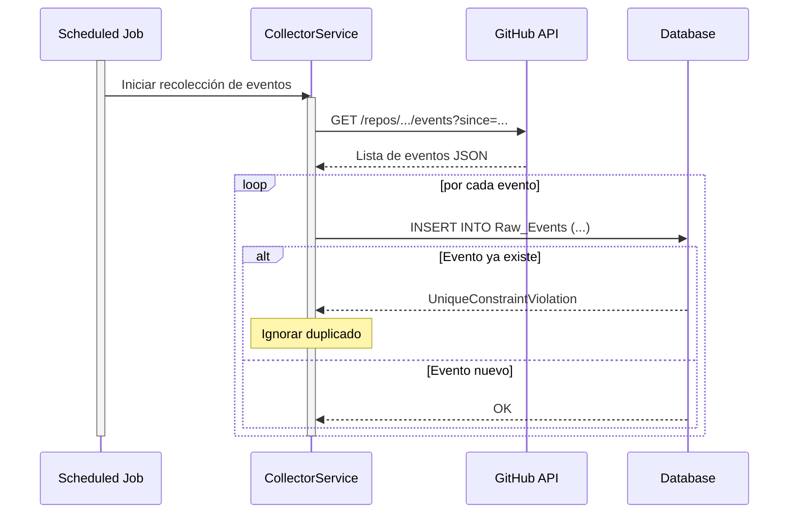

# Documento de Diseño de Software: Plataforma de Medición de Métricas DORA

**Versión:** 12.3 (Sincronización con Implementación del MVP)
**Autor:** Edson Abraham Chavez Montaño
**Fecha:** 6 de Setiembre de 2025 (Actualizado)

---

## 1. Introducción

### 1.1. Propósito
El presente documento describe la arquitectura, los componentes y el diseño general de la solución de software propuesta en la tesis "Propuesta de implementación de una solución para la medición de métricas de desempeño de entrega de software para equipos de desarrollo". Este documento servirá como guía técnica para la implementación del proyecto.

### 1.2. Resumen del Proyecto
El proyecto consiste en el desarrollo de una plataforma para la medición continua y automatizada del rendimiento de entrega de software, centrándose en las cuatro métricas clave de DORA (Frecuencia de Despliegue, Tiempo de Espera para Cambios, Tasa de Fallo de Cambio y Tiempo Medio de Recuperación). La solución extraerá datos de herramientas existentes en el ciclo de vida de desarrollo, los procesará y los presentará en dashboards visuales para facilitar la toma de decisiones basada en datos.

---

## 2. Objetivos y Resultados Esperados

### 2.1. Objetivo General
Implementar una solución para la medición continua del rendimiento de entrega de software en equipos de desarrollo, automatizando la recolección de datos de herramientas existentes, con el fin de proporcionar una base para la mejora continua y la predicción de resultados organizacionales.

### 2.2. Objetivos Específicos y Resultados Esperados

* **O1: Automatizar la recolección y consolidación de datos del ciclo de vida.**
    * **Resultado Esperado 1.1:** Un Módulo de Integración de Datos (`module-collector`) capaz de extraer y consolidar automáticamente los eventos clave del ciclo de vida del software desde las APIs de GitHub, Jira y DataDog.
    * **Resultado Esperado 1.2:** Una base de datos centralizada y estructurada que almacena de forma persistente tanto los datos crudos recolectados (`Raw_Events`) como las entidades de dominio procesadas (ej. `Commits`, `Deployments`).

* **O2: Calcular de manera continua métricas de desempeño de entrega.**
    * **Resultado Esperado 2.1:** Un Módulo de Procesamiento (`module-processor`) que calcula de forma continua y idempotente las cuatro métricas DORA a partir de las entidades de dominio estructuradas.
    * **Resultado Esperado 2.2:** La capacidad del sistema para agregar y almacenar las métricas calculadas (`Calculated_Metrics`) a nivel de repositorio individual y por equipo, permitiendo un análisis detallado del rendimiento.

* **O3: Implementar medios de visualización y reporte de métricas como apoyo a la toma de decisiones.**
    * **Resultado Esperado 3.1:** Un dashboard interactivo (utilizando Grafana embebido) que visualice las métricas DORA y sus tendencias a lo largo del tiempo, con vistas adaptadas a cada rol de usuario.
    * **Resultado Esperado 3.2:** Un Módulo de Notificaciones (`module-notifications`) capaz de enviar alertas por correo electrónico cuando se detecten desviaciones significativas en el rendimiento.

---

## 3. Alcance y Limitaciones

### 3.1. Dentro del Alcance (Visión Completa del Sistema)
- Desarrollo de un **Módulo de Integración** para la recolección de datos de GitHub, Jira y DataDog.
- Desarrollo de un **Módulo de Procesamiento** para el cálculo continuo de las 4 métricas DORA.
- Implementación de una **interfaz web** con un **Módulo de Visualización**.
- Implementación de un sistema de **alertas por correo electrónico**.
- Desarrollo de un **Módulo de Gestión de Roles**.
- Desarrollo de un **Módulo de Configuración del Sistema**.

### 3.2. Fuera del Alcance General
- El desarrollo de una aplicación móvil.
- La integración con herramientas distintas a las mencionadas en el alcance.

### 3.3. Alcance de la Implementación (MVP para la Tesis)
Para asegurar la entrega de un producto funcional en el tiempo estipulado, la implementación se centrará en un Producto Mínimo Viable (MVP) con el siguiente alcance:

* **Funcionalidades Incluidas en el MVP:**
    * **Integraciones:** Se implementará la integración completa con las 3 fuentes de datos: **GitHub, Jira y DataDog**.
    * **Cálculo de Métricas:** Se implementará el cálculo de las **4 métricas DORA**.
    * **Seguridad y Roles:** Se implementará el flujo de login completo con **GitHub**, la restricción por organización y la **gestión de roles** en la interfaz de usuario.
    * **Visualización:** Se implementará el dashboard con **vistas adaptativas** según el rol del usuario.
    * **Alertas:** Se implementará el sistema de **alertas por correo electrónico**.

* **Funcionalidades Simplificadas o Excluidas del MVP (Trabajo Futuro):**
    * **Gestión de Conexiones en la UI:** La configuración de las conexiones (claves de API, nombre de la organización) se manejará **exclusivamente a través de variables de entorno** en el despliegue. Se pospone la creación de la interfaz de usuario para esta gestión.
    * **Sincronización Manual en la UI:** El caso de uso para disparar una sincronización manual desde la interfaz de usuario se pospondrá. La sincronización operará únicamente de forma automática y periódica.
    * **Módulo de Observabilidad:** Una futura versión podría incluir un módulo dedicado a monitorear la salud del propio sistema de métricas (ej. estado de los jobs, latencia de la API, etc.).
    * **Módulo de Gobernanza de Datos:** Para gestionar el ciclo de vida de los datos, incluyendo políticas de retención y anonimización para cumplir con normativas de privacidad.

---

## 4. Personas y Roles de Usuario (RBAC)
El sistema implementará un Control de Acceso Basado en Roles (RBAC) estricto.

- **Administrador:**
    - **Acceso:** Tiene acceso a **todas las funcionalidades del sistema**, incluyendo la gestión de roles, la configuración del sistema y la visualización de todos los dashboards de métricas.
    - **Función:** Configurar, mantener y verificar el correcto funcionamiento de la aplicación, además de gestionar los roles de otros usuarios.
- **Engineering Manager:**
    - **Acceso:** Tiene una visión global de todas las métricas, de todos los equipos y todos los repositorios de la organización.
    - **Función:** Analizar el rendimiento organizacional, comparar equipos e identificar tendencias estratégicas.
- **Tech Lead:**
    - **Acceso:** Tiene acceso únicamente a las métricas de los repositorios y desarrolladores que pertenecen a su equipo.
    - **Función:** Monitorear la salud y el rendimiento de su equipo.
- **Desarrollador:**
    - **Acceso:** Visualiza las métricas relacionadas con su trabajo directo. Rol por defecto.
    - **Función:** Obtener feedback rápido sobre el impacto de su trabajo.

---

## 5. Arquitectura de Alto Nivel
La solución seguirá una arquitectura modular, con un claro desacoplamiento entre la recolección de datos, el procesamiento y la presentación. La comunicación entre el frontend y el backend se realizará exclusivamente a través de una API REST segura.

### 5.1. Estilo Arquitectónico del Backend
Para el backend, se ha elegido un enfoque de **Monolito Modular**. Esta decisión equilibra la simplicidad de desarrollo y despliegue de una aplicación monolítica con la disciplina de separación de dominios y bajo acoplamiento de una arquitectura de microservicios. Para implementar y verificar esta arquitectura, se utilizará el proyecto **Spring Modulith**.

- **Ventajas para este proyecto:**
    - **Un único repositorio y pipeline de CI/CD:** Reduce la complejidad operativa.
    - **Comunicación directa y performante entre módulos:** Evita la latencia de red y la complejidad de la comunicación entre servicios.
    - **Mantenimiento de la separación de dominios:** El código se organiza en módulos lógicos que evitan el acoplamiento indebido.
    - **Verificación Arquitectónica:** Spring Modulith permitirá crear pruebas que verifiquen automáticamente que las dependencias entre módulos son correctas, previniendo el deterioro arquitectónico.
    - **Preparado para el futuro:** Facilita la extracción de un módulo a un microservicio si fuera necesario en el futuro.

La comunicación entre los procesos de recolección y procesamiento de datos será **asíncrona y mediada por la base de datos**.
***Nota de Diseño (Comunicación Asíncrona):*** *Este enfoque es una simplificación pragmática para el alcance de este proyecto. Una evolución natural para un sistema a mayor escala sería incorporar un message broker dedicado (como RabbitMQ o Kafka) para un desacoplamiento aún más robusto.*

***Nota de Diseño (API REST vs. GraphQL):*** *Para la comunicación entre el frontend y el backend, se ha elegido una API REST por su simplicidad de implementación y su robusto ecosistema en Spring Boot. Si bien GraphQL podría ofrecer una mayor eficiencia en la obtención de datos para dashboards complejos, la combinación de una API REST bien diseñada con TanStack Query en el frontend mitiga los problemas de "over-fetching" y "under-fetching" de manera efectiva para el alcance de este proyecto. GraphQL se considera una posible evolución futura si los requisitos de consulta de datos se vuelven significativamente más complejos.*

### Diagrama de Flujo de Componentes

---

## 6. Detalle de Componentes del Backend

### 6.1. Vista General de Módulos
El backend se estructurará como un **Monolito Modular** utilizando **Spring Modulith**. El proyecto se organizará en los siguientes módulos lógicos (paquetes de Java), cada uno con responsabilidades bien definidas.

***Nota de Diseño:*** *Las dependencias entre módulos serán verificadas a través de pruebas de Spring Modulith. La comunicación entre `module-processor` y `module-notifications` se realiza de forma desacoplada a través de eventos de dominio, eliminando una dependencia de compilación directa. Las dependencias restantes son intencionales para permitir la orquestación y el acceso a la configuración.*

### 6.2. Detalle por Módulo

* **6.2.1. `module-domain`**
    * **Responsabilidad:** Actúa como el núcleo de la aplicación. Define la **Única Fuente de Verdad** para el modelo de datos.
    * **Componentes:** Clases de Entidad JPA (`@Entity`) e interfaces de Repositorio de Spring Data JPA (`JpaRepository`). **No contiene DTOs.**

* **6.2.2. `module-collector`**
    * **Responsabilidad:** Conectarse a las APIs externas para recolectar eventos de forma **idempotente**. Su función es guardar cada evento externo una única vez en la tabla `Raw_Events`. Utiliza DTOs específicos para cada fuente externa, implementando el patrón **Anticorruption Layer (ACL)**.
    * **Componentes:** Clases de servicio para cada integración, DTOs específicos para las APIs externas, lógica de scheduling con manejo de errores de duplicados.

* **6.2.3. `module-processor`**
    * **Responsabilidad:** Orquestar el pipeline de datos interno de forma resiliente.
        1.  Lee un lote de `Raw_Events` en estado `PENDING`.
        2.  Parsea los payloads y los transforma en entidades de dominio estructuradas.
        3.  Si el procesamiento de un evento falla, lo marca como `FAILED`, registra el error, y continúa con el siguiente.
        4.  Si es exitoso, calcula las métricas DORA y guarda los resultados.
        5.  Marca los `Raw_Events` exitosos como `COMPLETED`.
        6.  **Publica un evento de dominio** (ej. `MetricThresholdExceededEvent`) si se detectan cambios significativos en las métricas.
    * **Componentes:** Calculadoras de métricas, lógica de agregación, lógica de scheduling transaccional, manejo de errores.

* **6.2.4. `module-notifications`**
    * **Responsabilidad:** **Escuchar eventos de dominio** y gestionar el envío de notificaciones salientes en respuesta a ellos.
    * **Componentes:** Oyentes de eventos (`@EventListener`), Servicio de Email, plantillas de correo.

* **6.2.5. `module-administration`**
    * **Responsabilidad:** Gestionar la configuración del sistema (incluyendo el cifrado de secretos) y los roles de usuario.
    * **Componentes:** Lógica de negocio para la gestión de roles y configuración, servicio de criptografía.

* **6.2.6. `module-api`**
    * **Responsabilidad:** Exponer los datos y la funcionalidad a través de una API REST pública y segura. Actúa como la **fachada y orquestador** para todas las peticiones externas.
    * **Componentes:** Controladores REST que delegan la lógica a los servicios de los módulos `-processor` y `-administration`. DTOs que definen el contrato de la API. Configuración de Spring Security para OAuth y RBAC.

### 6.3. Base de Datos (MySQL)
El modelo de datos detallado, incluyendo las entidades, sus relaciones y la estrategia de indexación, se encuentra en el **Apéndice A**.

---

## 7. Modelo de Seguridad

- **Autenticación y Gestión de Sesión:** Se utilizará el protocolo **OAuth 2.0 con GitHub**. La sesión del usuario se gestionará a través de una **cookie segura (`HttpOnly`, `Secure`)** establecida por el backend. Esto mitiga el riesgo de robo de tokens por ataques XSS, ya que el token de sesión no es accesible desde el JavaScript del navegador.
- **Restricción de Acceso:** El acceso a la aplicación estará restringido únicamente a los miembros de una organización de GitHub específica, configurada en el sistema.
  ***Nota de Diseño (Seguridad vs. Disponibilidad):*** *Para el MVP, la verificación de pertenencia a la organización se realizará en tiempo real contra la API de GitHub en cada inicio de sesión. Este enfoque prioriza la seguridad, garantizando que el acceso sea siempre preciso. Sin embargo, crea una dependencia directa con la API de GitHub. Una evolución futura para mejorar la disponibilidad y el rendimiento sería implementar un sistema de caché que sincronice la lista de miembros periódicamente y verifique contra esa copia local.*
- **Proceso de Arranque (Bootstrap) del Primer Administrador:** Para evitar una vulnerabilidad en el primer inicio de sesión, el proceso será más robusto.
    - Se requerirá una variable de entorno en el momento del despliegue (ej. `INITIAL_ADMIN_GITHUB_USERNAME=nombre-de-usuario`).
    - En el primer arranque, si la base de datos no contiene administradores, el sistema buscará esta variable. Solo el usuario de GitHub especificado en ella podrá convertirse en el primer administrador al iniciar sesión.
- **Autorización (RBAC):** Una vez que un usuario autorizado ha iniciado sesión, el sistema aplicará el control de acceso basado en roles para determinar qué datos y funcionalidades puede ver.
- **Protección contra CSRF:** Dado que se usan cookies de sesión, el backend implementará protección contra Cross-Site Request Forgery.
  ***Nota de Implementación (MVP):*** *Para simplificar el desarrollo inicial de la SPA, se ha adoptado una estrategia donde el backend deshabilita la protección CSRF para los endpoints específicos que la necesitan (`/logout`, `/oauth2/**`), en lugar de implementar un sistema de intercambio de tokens anti-CSRF con el frontend. La seguridad se mantiene a través de la política de CORS estricta y la naturaleza de las peticiones (ej. el logout requiere un `POST`). Una evolución futura podría implementar un sistema de tokens CSRF completo si los requisitos de seguridad se vuelven más estrictos.*
- **Gestión de Secretos (Secrets Management):**
    - Los valores sensibles (claves de API, tokens) almacenados en la tabla `System_Configurations` serán **cifrados en reposo** (encryption at rest). La implementación se realizará utilizando la librería **Jasypt (Java Simplified Encryption)**.
    - La clave de cifrado maestra se proporcionará a la aplicación a través de una **variable de entorno** (ej. `JASYPT_ENCRYPTOR_PASSWORD`).
- **Estrategia de Configuración:** Se utilizarán dos mecanismos distintos para la configuración:
    - **Variables de Entorno:** Se usarán para configuraciones de arranque e infraestructura que la aplicación necesita para iniciarse. Son estáticas y no se modifican en tiempo de ejecución. Ejemplos: `DATABASE_URL`, `JASYPT_ENCRYPTOR_PASSWORD`, `INITIAL_ADMIN_GITHUB_USERNAME`.
    - **Tabla `System_Configurations`:** Se usará para configuraciones de negocio y de la aplicación que pueden ser modificadas por un Administrador a través de la UI sin necesidad de reiniciar el sistema. Ejemplos: `GITHUB_ORGANIZATION_NAME`, `JIRA_PROJECT_KEY`, umbrales para alertas de métricas.
- **Seguridad de la API para Grafana:** El token de sesión del usuario (en la cookie) será reenviado automáticamente por el navegador en las peticiones que Grafana haga a la API, asegurando que las consultas de datos respeten los permisos del usuario.

---

## 8. Stack Tecnológico

| Componente | Herramienta/Tecnología | Justificación |
| :--- | :--- | :--- |
| **Backend** | Java 21, Spring Boot 3.5.4 | Ecosistema robusto, maduro y de alto rendimiento. Aprovecha características modernas como Hilos Virtuales. |
| **Backend (Modularidad)** | **Spring Modulith** | Para verificar y documentar la arquitectura modular, previniendo el deterioro arquitectónico. |
| **Base de Datos** | MySQL 8+ | Sistema de BD relacional de código abierto, confiable y ampliamente utilizado. |
| **Visualización** | Grafana | Estándar de la industria para dashboards de monitoreo y métricas. |
| **Frontend** | React (con Vite) | Framework moderno, declarativo y basado en componentes, ideal para SPAs complejas. Vite ofrece una experiencia de desarrollo ultrarrápida. |
| **Frontend (Estado del Servidor)** | **TanStack Query** | Estándar de facto para gestionar la comunicación con APIs, el cacheo de datos y los estados de carga/error, simplificando el código y mejorando la experiencia de usuario. |
| **Frontend (Componentes)** | **Shadcn/UI** | Librería de componentes accesibles y componibles que se integra perfectamente con Tailwind CSS, acelerando el desarrollo de la UI. |
| **Contenerización** | Docker | Para empaquetar la aplicación y sus dependencias, garantizando consistencia. |
| **CI/CD** | GitHub Actions | Para automatizar la integración, pruebas y despliegue continuo. |
| **IaC** | Terraform | Para definir y provisionar la infraestructura de nube de forma declarativa. |

---

## 9. Casos de Uso Principales
A continuación se describen los casos de uso de alto nivel, agrupados por el actor principal que los inicia.

### 9.1. Casos de Uso Generales (Cualquier Usuario Autenticado)

| Caso de Uso | Actor Principal | Resumen |
| :--- | :--- | :--- |
| **Iniciar Sesión** | Usuario (No autenticado) | El usuario inicia el flujo de autenticación a través de GitHub para acceder a la aplicación. El acceso solo se concede si pertenece a la organización configurada. |
| **Cerrar Sesión** | Usuario (Autenticado) | El usuario finaliza su sesión activa en la aplicación. |

### 9.2. Casos de Uso de Administración (Rol: Administrador)

| Caso de Uso | Actor Principal | Resumen |
| :--- | :--- | :--- |
| **Configuración Inicial** | Primer Usuario | El primer usuario que inicia sesión en un sistema no configurado se convierte en Administrador y es guiado para realizar la configuración inicial. |
| **Gestionar Conexiones** | Administrador | El administrador puede añadir, editar o eliminar las configuraciones de conexión a las APIs externas (GitHub, Jira, DataDog). |
| **Gestionar Roles** | Administrador | El administrador puede asignar, ver y revocar los roles de los usuarios de la aplicación. |

### 9.3. Casos de Uso de Consulta (Roles: Engineering Manager, Tech Lead, Desarrollador)

| Caso de Uso | Actor Principal | Resumen |
| :--- | :--- | :--- |
| **Consultar Métricas** | Engineering Manager, Tech Lead, Desarrollador | El usuario visualiza los dashboards de métricas DORA. La vista y el alcance de los datos presentados se adaptan automáticamente según el rol del usuario. |

### 9.4. Casos de Uso del Sistema (Procesos Automatizados)

| Caso de Uso | Actor Principal | Resumen |
| :--- | :--- | :--- |
| **Disparar Notificación de Alerta** | Sistema | El sistema envía una notificación por correo electrónico cuando detecta una desviación significativa en una métrica calculada. |

---

## 10. Detalle de Historias de Usuario

* **HU-1: Iniciar Sesión**
    - **Como** un usuario no autenticado, **quiero** poder iniciar sesión con mi cuenta de GitHub, **para** acceder a la aplicación de forma segura.
    - **AC 1.1:** Dado que no estoy logueado, cuando hago clic en "Iniciar Sesión con GitHub", entonces soy redirigido a la página de autorización de GitHub.
    - **AC 1.2:** Dado que he autorizado la aplicación en GitHub, cuando soy redirigido de vuelta, entonces debo ver el dashboard principal y mi sesión debe estar activa.
    - **AC 1.3:** Dado que no soy miembro de la organización configurada, cuando intento iniciar sesión, entonces veo un mensaje de error de "Acceso Denegado".

* **HU-2: Cerrar Sesión**
    - **Como** un usuario autenticado, **quiero** poder cerrar mi sesión, **para** proteger mi cuenta cuando termine de usar la aplicación.
    - **AC 2.1:** Dado que estoy logueado, cuando hago clic en "Cerrar Sesión", entonces mi sesión se invalida y soy redirigido a la página de inicio de sesión.

* **HU-3: Configuración Inicial**
    - **Como** el primer usuario de la aplicación, **quiero** ser asignado automáticamente como Administrador, **para** poder realizar la configuración inicial del sistema.
    - **AC 3.1:** Dado que la aplicación no tiene una organización configurada ni administradores, cuando inicio sesión por primera vez, entonces mi usuario es creado con el rol de "Administrador".
    - **AC 3.2:** Dado que soy el primer administrador, después de iniciar sesión, entonces soy redirigido a la página de "Configuración del Sistema".

* **HU-4: Gestionar Conexiones (Backend)**
    - **Como** Administrador, **quiero** que el sistema pueda usar las credenciales de conexión, **para** que el sistema pueda recolectar datos.
    - **AC 4.1:** Dado que estoy en la página de configuración, cuando introduzco una clave de API válida y la guardo, entonces veo un mensaje de confirmación y la clave se almacena de forma cifrada.
    - **AC 4.2:** Dado que estoy en la página de configuración, cuando introduzco el nombre de la organización de GitHub y guardo, entonces el sistema valida que la aplicación tiene acceso a esa organización antes de guardar.

* **HU-5: Gestionar Roles**
    - **Como** Administrador, **quiero** poder ver una lista de todos los usuarios pertenecientes a la organización y asignarles roles, **para** controlar el acceso a la aplicación.
    - **AC 5.1:** Dado que estoy en la página de gestión de usuarios, cuando la página carga, entonces veo una tabla con todos los miembros de la organización de GitHub sincronizados.
    - **AC 5.2:** Dado que estoy viendo la lista de usuarios, entonces cada usuario que no tiene un rol explícitamente asignado se muestra con el rol por defecto "Desarrollador".
    - **AC 5.3:** Dado que estoy en la página de gestión de usuarios, cuando selecciono un usuario y le asigno el rol "Tech Lead", entonces el cambio se persiste y se refleja en la lista.
    - **AC 5.4:** Dado que estoy en la página de gestión de usuarios, cuando selecciono un usuario y le asigno el rol "Engineering Manager", entonces el cambio se persiste y se refleja en la lista.
    - **AC 5.5:** Dado que estoy en la página de gestión de usuarios, cuando selecciono un usuario y le asigno el rol "Administrador", entonces el cambio se persiste y se refleja en la lista.

* **HU-6: Dashboard de Engineering Manager**
    - **Como** Engineering Manager, **quiero** ver un dashboard con las métricas DORA agregadas a nivel de toda la organización, **para** entender el rendimiento general de la ingeniería.
    - **AC 6.1:** Dado que he iniciado sesión como Engineering Manager, cuando accedo al dashboard, entonces los gráficos muestran por defecto los datos de todos los equipos.
    - **AC 6.2:** Dado que estoy viendo el dashboard, cuando uso el filtro de equipo y selecciono "Equipo Alfa", entonces todos los gráficos se actualizan para mostrar solo los datos del "Equipo Alfa".

* **HU-7: Dashboard de Tech Lead**
    - **Como** Tech Lead, **quiero** ver un dashboard con las métricas DORA específicas de mi equipo y sus repositorios, **para** monitorear la salud y la eficiencia de mi equipo.
    - **AC 7.1:** Dado que he iniciado sesión como Tech Lead del "Equipo Beta", cuando accedo al dashboard, entonces solo veo los datos del "Equipo Beta".
    - **AC 7.2:** Dado que soy Tech Lead, cuando veo el dashboard, entonces no tengo la opción de filtrar por otros equipos.

* **HU-8: Dashboard de Desarrollador**
    - **Como** Desarrollador, **quiero** ver un dashboard con las métricas DORA de los repositorios en los que contribuyo, **para** entender el impacto de mi trabajo en el ciclo de entrega.
    - **AC 8.1:** Dado que he iniciado sesión como Desarrollador, cuando accedo al dashboard, entonces los gráficos muestran por defecto los datos de todos los repositorios en los que he hecho commits.

* **HU-9: Enviar Notificación de Alerta de Métrica**
    * **Como** el sistema, **quiero** enviar una notificación por correo electrónico, **para** alertar a los usuarios relevantes sobre cambios significativos en el rendimiento.
    * **AC 9.1:** Dado que el `module-processor` ha calculado una nueva métrica, cuando el valor de esta métrica excede un umbral predefinido, entonces se dispara un evento de notificación.
    * **AC 9.2:** Dado que se ha disparado un evento de notificación, cuando el `module-notifications` lo recibe, entonces se envía un correo electrónico al Tech Lead o Engineering Manager responsable del repositorio o equipo afectado.

* **HU-10: Recolectar Datos de GitHub**
    * **Como** el sistema, **quiero** conectarme a la API de GitHub de forma periódica, **para** recolectar eventos de PRs, commits y deployments.
    * **AC 10.1:** Dado que el job de recolección se ejecuta, cuando se conecta a la API de GitHub, entonces obtiene los eventos nuevos desde la última ejecución.
    * **AC 10.2:** Dado que se obtiene un evento nuevo, cuando se intenta guardar en la base de datos, entonces se previene la inserción de duplicados.

* **HU-11: Procesar Métricas de Velocidad**
    * **Como** el sistema, **quiero** procesar los datos de GitHub, **para** calcular la Frecuencia de Despliegue y el Tiempo de Espera para Cambios.
    * **AC 11.1:** Dado que hay eventos de despliegue y commits en la base de datos, cuando el job de procesamiento se ejecuta, entonces se calcula y guarda correctamente la métrica de Frecuencia de Despliegue.
    * **AC 11.2:** Dado que hay eventos de commits y PRs, cuando el job de procesamiento se ejecuta, entonces se calcula y guarda correctamente la métrica de Tiempo de Espera para Cambios.

* **HU-12: Recolectar Datos de Jira**
    * **Como** el sistema, **quiero** conectarme a la API de Jira de forma periódica, **para** enriquecer los datos de los commits.
    * **AC 12.1:** Dado que el job de recolección se ejecuta, cuando se conecta a la API de Jira, entonces obtiene los datos de los tickets mencionados en los commits.
    * **AC 12.2:** Dado que se obtiene un evento de Jira, cuando se intenta guardar en la base de datos, entonces se previene la inserción de duplicados.

* **HU-13: Recolectar Datos de DataDog**
    * **Como** el sistema, **quiero** conectarme a la API de DataDog de forma periódica, **para** recolectar eventos de incidentes.
    * **AC 13.1:** Dado que el job de recolección se ejecuta, cuando se conecta a la API de DataDog, entonces obtiene los incidentes nuevos y los guarda en la base de datos.
    * **AC 13.2:** Dado que se obtiene un incidente de DataDog, cuando se intenta guardar en la base de datos, entonces se previene la inserción de duplicados.

* **HU-14: Procesar Métricas de Estabilidad**
    * **Como** el sistema, **quiero** procesar los datos de despliegues e incidentes, **para** calcular la Tasa de Fallo de Cambio y el Tiempo Medio de Recuperación.
    * **AC 14.1:** Dado que hay eventos de despliegues e incidentes, cuando el job de procesamiento se ejecuta, entonces se calcula y guarda correctamente la métrica de Tasa de Fallo de Cambio.
    * **AC 14.2:** Dado que hay eventos de incidentes, cuando el job de procesamiento se ejecuta, entonces se calcula y guarda correctamente la métrica de Tiempo Medio de Recuperación.

* **HU-15: Estructura Base del Frontend**
    * **Como** desarrollador, **quiero** una estructura de proyecto React con ruteo y layouts, **para** tener una base sólida sobre la cual construir la UI.
    * **AC 15.1:** Dado que la aplicación carga, cuando un usuario no está autenticado, entonces se le muestra la `LoginPage`.
    * **AC 15.2:** Dado que un usuario está autenticado, cuando navega por la aplicación, entonces ve el `AuthenticatedLayout` (header y sidebar) de forma persistente.

* **HU-16: Página de Administración de Roles**
    * **Como** Administrador, **quiero** una interfaz para gestionar los roles de los usuarios, **para** controlar los permisos de la aplicación.
    * **AC 16.1:** Dado que he iniciado sesión como Administrador, cuando navego a la página de administración, entonces veo una tabla con los usuarios de la organización.
    * **AC 16.2:** Dado que estoy viendo la tabla de usuarios, cuando cambio el rol de un usuario, entonces se realiza una llamada a la API y la UI se actualiza con el nuevo rol.

* **HU-17: Implementar un Modelo de Acceso "Cerrado por Defecto" en el Arranque**
    * **Como** administrador del sistema, **necesito** que la aplicación bloquee por defecto todos los inicios de sesión, excepto el del administrador inicial designado, cuando aún no he configurado una organización de GitHub, **para** garantizar la máxima seguridad desde el primer despliegue y prevenir cualquier registro de usuario no autorizado antes de que el sistema esté completamente configurado.
    * **AC 17.1:** Dado que el sistema está en su estado de arranque inicial, cuando un usuario que no es el administrador inicial intenta iniciar sesión, entonces el acceso debe ser denegado.
    * **AC 17.2:** Dado que el sistema está en su estado de arranque inicial, cuando el usuario que es el administrador inicial intenta iniciar sesión, entonces debe ser creado exitosamente con el rol de ADMIN.
    * **AC 17.3:** Dado que un ADMIN ya existe en el sistema y la organización aún no está configurada, cuando un nuevo usuario intenta iniciar sesión, entonces su acceso debe ser denegado.

* **HU-18: Interfaz de Usuario para Cerrar Sesión**
    * **Como** usuario autenticado, **quiero** poder cerrar mi sesión de forma segura, **para** proteger mi cuenta de accesos no autorizados.
    * **AC 18.1:** Dado que he iniciado sesión, cuando navego por la aplicación, entonces veo un elemento claramente identificable para "Cerrar Sesión".
    * **AC 18.2:** Dado que estoy viendo el botón "Cerrar Sesión", cuando hago clic en él, entonces soy redirigido inmediatamente a la página de inicio (`/`).
    * **AC 18.3:** Dado que he cerrado sesión, cuando intento acceder a una ruta protegida, entonces se me deniega el acceso y soy redirigido a la página de inicio de sesión.

* **HU-19: Crear Página de Inicio de Sesión**
    * **Como** usuario no autenticado, **quiero** ver una página de bienvenida simple que me invite a iniciar sesión con mi cuenta de GitHub para poder acceder a la aplicación.
    * **AC 19.1:** Dado que no he iniciado sesión, cuando visito la raíz de la aplicación (`/`), entonces se me presenta una página de bienvenida.
    * **AC 19.2:** Dado que estoy en la página de bienvenida, cuando hago clic en el botón "Iniciar Sesión con GitHub", entonces soy redirigido al flujo de autorización de GitHub.

* **HU-20: Crear Página Principal (Home) para Usuarios Autenticados**
    * **Como** usuario que ha iniciado sesión, **quiero** ser dirigido a una página principal o "Home" donde pueda ver contenido exclusivo y acceder a acciones como "Cerrar Sesión".
    * **AC 20.1:** Dado que he completado el inicio de sesión con éxito, cuando soy redirigido por el sistema, entonces aterrizo en una URL protegida (ej. `/home` o `/dashboard`).
    * **AC 20.2:** Dado que estoy en la página principal, cuando observo el contenido, entonces veo un mensaje de bienvenida simple y el botón "Cerrar Sesión".

---

## 11. Diseño del Frontend

### 11.1. Framework y Herramientas
- **Framework:** **React (con Vite)**. Se elige React por su robusto ecosistema, su modelo de componentes declarativo y el amplio soporte de la comunidad. Vite se utilizará como herramienta de build por su experiencia de desarrollo extremadamente rápida (Hot Module Replacement).
- **Lenguaje:** **TypeScript**. Para añadir seguridad de tipos y mejorar la mantenibilidad del código.
- **Estilos:** **Tailwind CSS**. Un framework CSS "utility-first" que permite construir diseños complejos rápidamente sin salir del HTML, promoviendo la consistencia visual.
- **Librería de Componentes:** **Shadcn/UI**. Para acelerar el desarrollo de la UI, se utilizará esta librería de componentes accesibles y componibles que se integra perfectamente con Tailwind CSS.
- **Gestión de Estado:**
    - **Estado Global de UI:** **React Context API con Hooks**. Para gestionar el estado de la sesión del usuario (información del usuario, rol), que es global y cambia con poca frecuencia.
      ***Nota de Implementación (MVP):*** *En la implementación actual, el estado del usuario se obtiene localmente en los componentes que lo necesitan (ej. `HomePage`) usando `useState` y `useEffect`. Se introducirá un `AuthContext` global cuando múltiples componentes no relacionados necesiten acceder a esta información, para evitar llamadas redundantes a la API.*
    - **Estado del Servidor:** **TanStack Query (React Query)**. Para gestionar todo el ciclo de vida de las peticiones a la API: fetching, caching, sincronización y actualización de datos del servidor.
      ***Nota de Implementación (MVP):*** *Para las funcionalidades iniciales, las llamadas a la API se están gestionando directamente con `useState` y `useEffect`. Esta decisión simplifica la configuración inicial. Se planea introducir `TanStack Query` en fases posteriores, especialmente para la implementación de los dashboards, donde sus capacidades de cacheo y sincronización automática serán más beneficiosas.*

***Nota de Diseño (Monolito Frontend vs. Microfrontends):*** *Para el alcance del MVP, se ha elegido un enfoque de **monolito de frontend**. Esta decisión prioriza la velocidad de desarrollo y la simplicidad operativa. Una evolución futura para una organización con múltiples equipos de frontend podría ser la descomposición de la aplicación en **microfrontends** (ej. un microfrontend para la administración y otro para los dashboards) para permitir un desarrollo y despliegue independientes.*

### 11.2. Estructura de Componentes Principales
La aplicación se organizará en una jerarquía de componentes reutilizables.

- **`App.tsx`**: El componente raíz que inicializa la aplicación.
- **`Router`**: Gestiona las rutas de la aplicación (ej. `/login`, `/home`, `/admin`).
- **`LoginPage`**: Página de inicio de sesión, visible para usuarios no autenticado.
- **`AuthenticatedLayout`**: Un componente "wrapper" que define la estructura común para las páginas protegidas (Header, etc.).
- **`Header`**: Muestra el nombre de la aplicación y el botón de "Cerrar Sesión".
- **`Sidebar`**: ***(Trabajo Futuro)*** Contendrá los enlaces de navegación principal (ej. "Dashboard", "Administración"). La visibilidad de los enlaces dependerá del rol del usuario. En el MVP actual, la navegación se limita a la cabecera.
- **`DashboardPage`**: La página principal que contendrá los paneles de Grafana embebidos. Su contenido se adaptará según el rol del usuario (EM, TL, Dev).
- **`AdminPage`**: Una página que contendrá las herramientas de administración.
- **`UserManagement`**: Componente para la gestión de roles de usuario (visible solo para Admins).
- **`ConnectionSettings`**: Componente para gestionar las conexiones a las APIs externas (visible solo para Admins).

### 11.3. Flujo de Datos y Estado
1.  Al iniciar sesión, el backend establece una **cookie de sesión `HttpOnly`**.
2.  Los componentes que necesitan datos del servidor (ej. `HomePage`) utilizan el hook `useEffect` para ejecutar una llamada `fetch` cuando se montan.
3.  La petición `fetch` se configura con la opción **`credentials: 'include'`** para asegurar que la cookie de sesión se envíe al backend.
4.  La respuesta de la API se almacena en el estado local del componente usando el hook `useState`, y la UI se actualiza para mostrar los datos. Los estados de carga y error se gestionan también con `useState`.

### 11.4. Estrategia de Implementación por Fases
La construcción del frontend seguirá un enfoque pragmático en tres fases principales:

* **Fase 1: La Fundación - Flujo de Sesión Completo (HU-15, HU-18, HU-19, HU-20)**
  El objetivo es tener una aplicación donde un usuario pueda entrar, ser reconocido y salir.

    1. **Configuración y Página de Aterrizaje:** Crear el proyecto React, configurar las herramientas y construir la `LoginPage` con el botón de login.

    2. **Rutas Protegidas y Contexto de Autenticación:** Implementar el `Router` y el `AuthenticatedLayout`. Este último verificará la sesión del usuario llamando a un endpoint `/api/user/me` y gestionará la redirección a la página de login si no está autenticado.

    3. **Página Principal y Cierre de Sesión:** Crear una página principal simple y el `Header` con la información del usuario y el botón de logout funcional.

* **Fase 2: El Panel de Administración (HU-16)**
  El objetivo es construir la funcionalidad que requiere más interacción con la API (lectura y escritura).

    1. **Crear Componentes de UI:** Construir la `AdminPage` y el componente `UserManagement` utilizando componentes de Shadcn/UI (como la tabla).

    2. **Integrar con TanStack Query:** Usar `useQuery` para leer la lista de usuarios y `useMutation` para actualizar los roles, asegurando que la UI se actualice automáticamente.

* **Fase 3: Los Dashboards (HU-6, 7, 8)**
  El objetivo es integrar la visualización de datos.

    1. **Crear `DashboardPage`:** Este componente consumirá el `AuthContext` para obtener el rol del usuario.

    2. **Integrar Grafana:** Embeber los paneles de Grafana usando un `iframe`.

    3. **Hacer Dashboards Dinámicos:** Construir la URL del `iframe` dinámicamente basándose en el rol del usuario para mostrar la vista de datos correcta.

---

## Apéndice A: Diagramas de Diseño Detallado

### A.1: Modelo Físico de Base de Datos (ERD)

### A.2: Diagramas de Implementación (Trabajo en Progreso)

Esta sección contendrá diagramas de Clases y de secuencia detallados para flujos de negocio complejos a medida que se implementen.

#### Diagrama de Secuencia: `module-collector` (GitHub)

## Apéndice B: Estrategia de Integración y Despliegue Continuo (CI/CD)

La estrategia de CI/CD se implementará utilizando **GitHub Actions**. La documentación detallada y los scripts de los workflows se mantendrán directamente en el repositorio de código, siguiendo el principio de "Docs as Code".

### B.1: Estrategia de Alto Nivel

El pipeline de CI/CD se diseñará para automatizar el proceso de construcción, prueba y despliegue de la aplicación.

* **Disparadores (Triggers):**

    * El workflow principal se ejecutará automáticamente en cada `push` a la rama `main`.

    * También se ejecutará en la creación de `Pull Requests` que apunten a `main`, para validar los cambios antes de que se integren.

* **Etapas Principales (Jobs):**

    1. **Build & Test:**

        * Se compilará el backend de Spring Boot utilizando Gradle.

        * Se ejecutarán todas las pruebas unitarias y de integración, incluyendo las pruebas de verificación de la arquitectura de Spring Modulith.

    2. **Build Docker Image:**

        * Si la etapa anterior es exitosa, se construirá la imagen de Docker de la aplicación.

        * La imagen se etiquetará con el SHA del commit y se subirá a un registro de contenedores (ej. GitHub Container Registry).

    3. **Deploy:**

        * Esta etapa se ejecutará solo en los `push` a `main`.

        * Utilizará Terraform para provisionar o actualizar la infraestructura en la nube.

        * Desplegará la nueva versión de la imagen de Docker en el entorno de producción.

### B.2: Documentación Detallada

La implementación específica y los scripts de los workflows de GitHub Actions se encuentran documentados en el siguiente archivo dentro del repositorio del proyecto:

* `[Enlace al README.md en .github/workflows/ en tu repositorio]`
